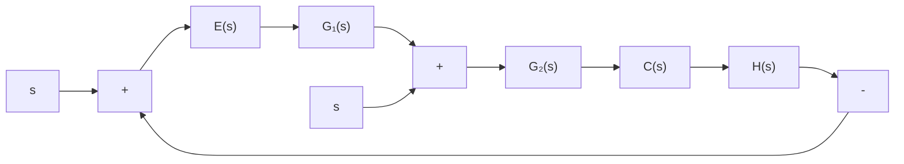

# 6. 闭环系统的传递函数

反馈控制系统的传递函数,一般可以由组成系统的元部件运动方程式求得,但更方便的是由系统结构图或信号流图求取。一个典型的反馈控制系统的结构图和信号流图如图2-42所示。图中,R(s)和N(s)都是施加于系统的外作用,R(s)是有用输入作用,简称输入信号;N(s)是扰动作用;C(s)是系统的输出信号。为了研究有用输入作用对系统输出C(s)的影响,需要求有用输入作用下的闭环传递函数C(s)/R(s)。同样,为了研究扰动作用N(s)对系统输出C(s)的影响,也需要求取扰动作用下的闭环传递函数C(s)/N(s)。此外,在控制系统的分析和设计中,还常用到在输入信号R(s)或扰动N(s)作用下,以误差信号E(s)作为输出量的闭环误差传递函数E(s)/R(s)或E(s)/N(s)。


<details>
<summary>flowchart</summary>


</details>


<details>
<summary>flowchart</summary>

```mermaid
graph TD
    R["R(s)"] -->|1| G1["G1"]
    G1 --> G2["G2"]
    G2 --> C["C"]
    C --> C'[C(s)]
    E["E"] -->|1| G1
    E -->|-H| C
    N["N(s)"] --> G2
    style N fill:#fff,stroke:#000
    style E fill:#fff,stroke:#000
    style C fill:#fff,stroke:#000
    style C' fill:#fff,stroke:#000
    style G1 fill:#fff,stroke:#000
    style G2 fill:#fff,stroke:#000
    style C fill:#fff,stroke:#000
    style C' fill:#fff,stroke:#000
    style E fill:#fff,stroke:#000
    style H fill:#fff,stroke:#000
```
</details>

图 2-42 反馈控制系统的典型结构图和信号流图
