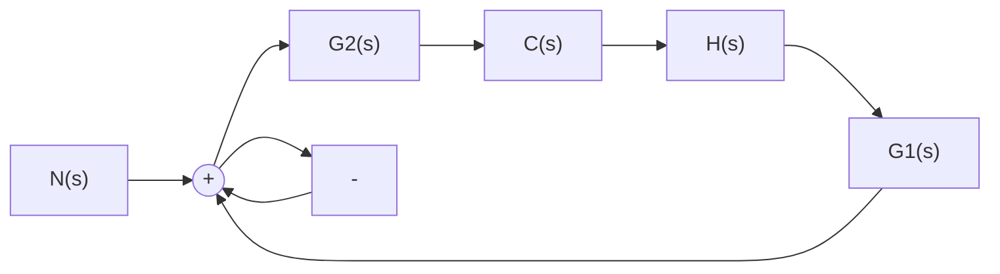

# (2) 扰动作用下的闭环传递函数

应用叠加原理, 令 $R(s) = 0$ , 可直接由梅森公式求得扰动作用 $N(s)$ 到输出信号 $C(s)$ 之间的闭环传递函数

$$\Phi_ {n} (s) = \frac {C (s)}{N (s)} = \frac {G _ {2} (s)}{1 + G _ {1} (s) G _ {2} (s) H (s)} \tag {2-85}$$

式(2-85)也可从图 2-42(a)的系统结构图改画为图 2-43的系统结构图后求得。同样，由此可求得系统在扰动作用下的输出

$$C (s) = \Phi_ {n} (s) N (s) = \frac {G _ {2} (s)}{1 + G _ {1} (s) G _ {2} (s) H (s)} N (s)$$

显然, 当输入信号 $R(s)$ 和扰动作用 $N(s)$ 同时作用时系统的输出为

$$
\begin{array}{l} \sum C (s) = \Phi (s) \cdot R (s) + \Phi_ {n} (s) \cdot N (s) \\ = \frac {1}{1 + G _ {1} (s) G _ {2} (s) H (s)} \left[ G _ {1} (s) G _ {2} (s) R (s) + G _ {2} (s) N (s) \right] \\ \end{array}
$$

flowchart

图 2-43 在扰动作用下 $(R(s)=0$ 时
系统结构图

上式如果满足 $|G_{1}(s)G_{2}(s)H(s)|\gg 1$ 和 $|G_{1}(s)H(s)|\gg 1$ 的条件，则可简化为

$$\sum C (s) \approx \frac {1}{H (s)} R (s) \tag {2-86}$$

式(2-86)表明,在一定条件下,系统的输出只取决于反馈通路传递函数 $H(s)$ 及输入信号 $R(s)$ ,既与前向通路传递函数无关,也不受扰动作用的影响。特别是当 $H(s)=1$ , 即单位反馈时, $C(s)\approx R(s)$ , 从而近似实现了对输入信号的完全复现,且对扰动具有较强的抑制能力。
