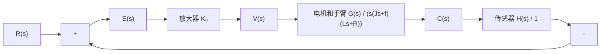

假定簧片是完全刚性的,不会出现明显的弯曲,则磁盘驱动读取系统的模型如图2-46(b)所示。

flowchart

(a)

flowchart

(b)   
图 2-46 磁盘驱动读取系统框图

磁盘驱动读取系统的典型参数如表 2-3 所示。由表 2-3 可得

$$G (s) = \frac {5 0 0 0}{s (s + 2 0) (s + 1 0 0 0)} \tag {2-89}$$

上式还可以改写为

$$G (s) = \frac {K _ {m} / f R}{s (T _ {L} s + 1) (T s + 1)} \tag {2-90}$$

其中， $T_{L}=J/f=50ms;T=L/R=1ms$ 。由于 $T\ll T_{L}$ ，常常略去T，可得

$$G (s) \approx \frac {K _ {m} / f R}{s (T _ {L} s + 1)} = \frac {0 . 2 5}{s (0 . 0 5 s + 1)} = \frac {5}{s (s + 2 0)}$$

利用 $G(s)$ 的二阶近似表示,该磁盘驱动读取系统的闭环传递函数为

$$\frac {C (s)}{R (s)} = \frac {K _ {a} G (s)}{1 + K _ {a} G (s)} = \frac {5 K _ {a}}{s ^ {2} + 2 0 s + 5 K _ {a}} \tag {2-91}$$

当取 $K_{a} = 40$ 时，有 $C(s) = \frac{200}{s^2 + 20s + 200} R(s)$ ，若令 $R(s) = 1 / s$ ，使用MATLAB的函数step，可得该系统的阶跃响应曲线，如图2-47所示。

表 2-3 磁盘驱动读取系统典型参数

<table><tr><td>参数</td><td>符号</td><td>典型值</td></tr><tr><td>手臂与磁头的转动惯量</td><td>J</td><td>1N·m·s2/rad</td></tr><tr><td>摩擦系数</td><td>f</td><td>20N·m·s/rad</td></tr><tr><td>放大器增益</td><td>Ka</td><td>10~1000</td></tr><tr><td>电枢电阻</td><td>R</td><td>1Ω</td></tr><tr><td>电机传递系数</td><td>Km</td><td>5N·m/A</td></tr><tr><td>电枢电感</td><td>L</td><td>1mH</td></tr></table>

MATLAB 文本：

$$\mathrm{G} = \mathrm{zpk} ([ ], [ 0 - 2 0 - 1 0 0 0 ], 5 0 0 0); \mathrm{Ka} = 4 0; \text { sys } = \text { feedback } (\mathrm{Ka} * \mathrm{G}, 1);\mathrm{t} = 0: 0. 0 1: 1; \text { step(sys,t) }; \text { grid }; \text { axis } ([ 0, 1, 0 1. 2 ])$$

line

| Time/sec | Amplitude |
| --- | --- |
| 0.0 | 0.0 |
| 0.1 | 0.4 |
| 0.2 | 0.9 |
| 0.3 | 1.05 |
| 0.4 | 1.03 |
| 0.5 | 1.01 |
| 0.6 | 1.00 |
| 0.7 | 1.00 |
| 0.8 | 1.00 |
| 0.9 | 1.00 |
| 1.0 | 1.00 |

图 2-47 磁盘驱动读取系统的阶跃响应(MATLAB)
