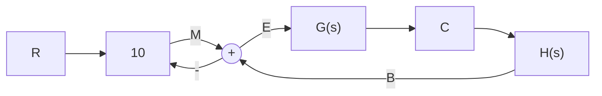

# 2-5 设初始条件均为零,试用拉氏变换法求

解下列微分方程式，并概略绘制 $x(t)$ 曲线，指出各方程式的模态：

(1) $2\dot{x}(t)+x(t)=t;$   
(2) $\ddot{x}(t) + \dot{x}(t) + x(t) = \delta(t)$ ;   
(3) $\ddot{x}(t) + 2\dot{x}(t) + x(t) = 1(t)$ 。

2-6 在液压系统管道中,设通过阀门的流量 Q 满足如下流量方程:

$$Q = K \sqrt {P}$$

式中，K 为比例常数；P 为阀门前后的压差。若流量 Q 与压差 P 在其平衡点 $(Q_{0}, P_{0})$ 附近做微小变化，试导出线性化流量方程。

2-7 设弹簧特性由下式描述：

$$F = 1 2. 6 5 y ^ {1. 1}$$

其中， $F$ 是弹簧力； $y$ 是变形位移。若弹簧在变形位移 0.25 附近做微小变化，试推导 $\Delta F$ 的线性化方程。

2-8 设晶闸管三相桥式全控整流电路的输入量为控制角 $\alpha$ ，输出量为空载整流电压 $e_{d}$ ，其间的关系为 $e_{d} = E_{d_{0}} \cos \alpha$ ，式中 $E_{d_{0}}$ 是整流电压的理想空载值，试推导其线性化方程式。  
2-9 若某系统在阶跃输入 $r(t) = 1(t)$ 时，零初始条件下的输出响应 $c(t) = 1 - \mathrm{e}^{-2t} + \mathrm{e}^{-t}$ ，试求系统的传递函数和脉冲响应。

2-10 设系统传递函数为

$$\frac {C (s)}{R (s)} = \frac {2}{s ^ {2} + 3 s + 2}$$

初始条件 $c(0)=-1,\dot{c}(0)=0$ 。求单位阶跃输入 $r(t)=1(t)$ 时，系统的输出响应 $c(t)$ 。

2-11 在图 2-51 中, 已知 $G(s)$ 和 $H(s)$ 两方框相对应的微分方程分别是

flowchart

图 2-51 题 2-11 系统结构图

$$6 \frac {\mathrm{d} c (t)}{\mathrm{d} t} + 1 0 c (t) = 2 0 e (t)2 0 \frac {\mathrm{d} b (t)}{\mathrm{d} t} + 5 b (t) = 1 0 c (t)$$

且初始条件均为零，试求传递函数 $C(s)/R(s)$ 及 $E(s)/R(s)$ 。

2-12 求图 2-52 所示有源网络的传递函数 $U_{o}(s)/U_{i}(s)$ 。

text_image

C₀
R₀
R₁
-Uᵢ
-K
Uₒ

(a)

text_image

C₀
R₀
R₁
C₁
- K
Uᵢ
Uₒ

(b)

text_image

R₂
C₂
R₁
R₀
Ui
-K
Uₒ

(c)   
图 2-52 有源网络

2-13 由运算放大器组成的控制系统模拟电路如图 2-53 所示, 试求闭环传递函数 $U_{o}(s)/U_{i}(s)$ 。

text_image

C1
R1
Ui R0 -K R0 R0 C2
R0 R2
-K
-Uo

图 2-53 控制系统模拟电路

2-14 试参照例 2-2 给出的电枢控制直流电动机的三组微分方程式, 画出直流电动机的结构图, 并由结构图等效变换求出电动机的传递函数 $\Omega_{m}(s)/U_{a}(s)$ 和 $\Omega_{m}(s)/M_{c}(s)$ 。  
2-15 某位置随动系统原理方块图如图 2-54 所示。已知电位器最大工作角度 $\theta_{max}=330^{\circ}$ ，功率放大级放大系数为 $K_{3}$ ，要求：
