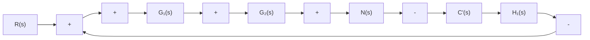
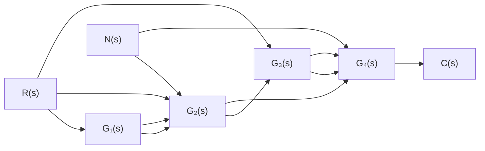
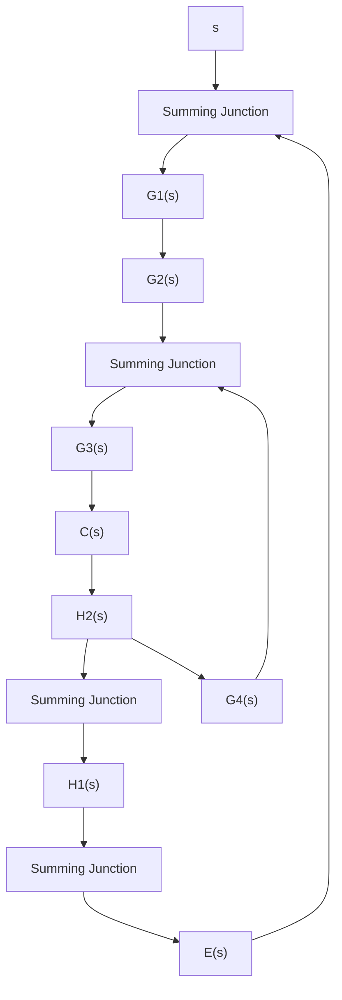

(1) 分别求出电位器传递系数 $K_{0}$ ，第一级和第二级放大器的比例系数 $K_{1}$ 和 $K_{2}$ ;  
(2) 画出系统结构图；  
(3) 简化结构图, 求系统传递函数 $\Theta_{o}(s)/\Theta_{i}(s)$ 。

text_image

K0
θi
+15V
-15V 10kΩ
30kΩ
10kΩ
20kΩ
-K1
-K2
功放器
K3
SM
TG
+
-
+
-
K0
+15V
-15V
θo

图 2-54 位置随动系统原理图

2-16 设直流电动机双闭环调速系统的原理线路如图 2-55 所示, 要求:

(1) 分别求速度调节器和电流调节器的传递函数；  
(2) 画出系统结构图(设可控硅电路传递函数为 $K_{3} / (T_{3}s + 1)$ ; 电流互感器和测速发电机的传递系数分别为 $K_{4}$ 和 $K_{5}$ ; 直流电动机的结构图用题 2-14 的结果);  
(3) 简化结构图, 求系统传递函数 $\Omega(s)/U_{i}(s)$ 。

text_image

电流
互感器
R
C1
R1
R2
C2
晶闸管
电路
R
-U1
R
-R
-K
- K
电流
调节器
Ua
扼流圈ω
SM
+
-
负
T G

图 2-55 直流电动机调速系统原理图

2-17 已知控制系统结构图如图 2-56 所示,试通过结构图等效变换求系统传递函数 $C(s)/R(s)$ 。  
2-18 试简化图 2-57 中的系统结构图, 并求传递函数 $C(s)/R(s)$ 和 $C(s)/N(s)$ 。  
2-19 试绘制图 2-56 中各系统结构图对应的信号流图, 并用梅森增益公式求各系统的传递函数 $C(s)/R(s)$ 。  
2-20 画出图 2-57 中各系统结构图对应的信号流图, 并用梅森增益公式求传递函数 $C(s)/R(s)$ 和 $C(s)/N(s)$ 。  
2-21 试绘制图 2-58 中系统结构图对应的信号流图, 并用梅森增益公式求传递函数 $C(s)/R(s)$ 和 $E(s)/R(s)$ 。

  
图 2-56 题 2-17 系统结构图

flowchart

(a)

flowchart

(b)   
图 2-57 题 2-18 系统结构图

flowchart

(a)
