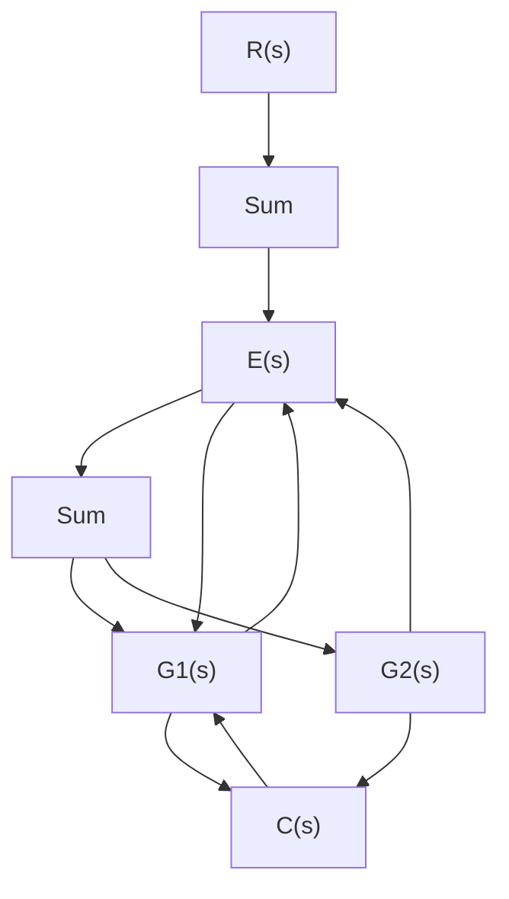
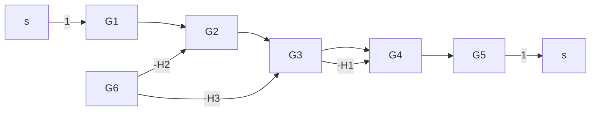
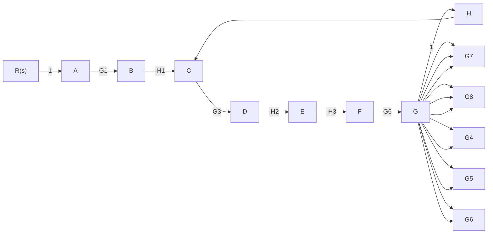
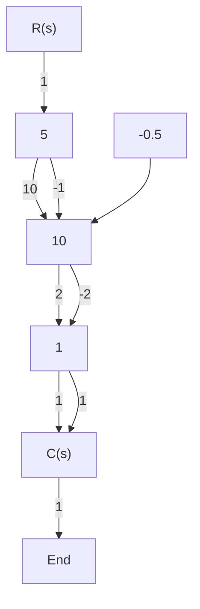
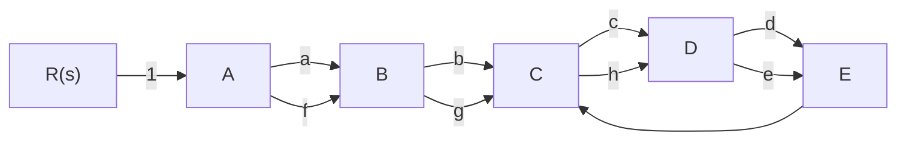
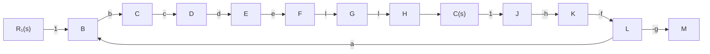

<details>
<summary>flowchart</summary>


</details>

(b)   
图 2-58 题 2-21 系统结构图

2-22 试用梅森增益公式求图 2-59 中各系统信号流图的传递函数 $C(s)/R(s)$ 。


<details>
<summary>flowchart</summary>


</details>

(a)


<details>
<summary>flowchart</summary>


</details>

(b)   


<details>
<summary>flowchart</summary>


</details>

(c)


<details>
<summary>flowchart</summary>


</details>

(d)


<details>
<summary>flowchart</summary>


</details>

(c)


<details>
<summary>flowchart</summary>

```mermaid
graph TD
    R3[" R₃(s) "] -->|1| A(( ))
    A -->|a| R1[" R₁(s) "]
    A -->|d| B(( ))
    B -->|b| R1
    B -->|e| C(( ))
    C -->|h| D((C(s))|
    C -->|j| D
    C -->|i| E(( ))
    E -->|g| F(( ))
    F -->|c| R2[" R₂(s) "]
    F -->|1| G(( ))
    G --> R2
```
</details>

(f)   
图 2-59 题 2-22 系统信号流图
