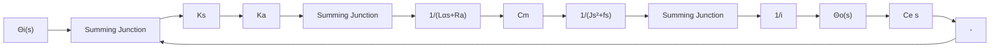

# 1. 二阶系统的数学模型

设位置控制系统如图 3-6 所示, 其任务是控制有黏性摩擦和转动惯量的负载, 使负载位置与

text_image

发送
Rp
θi
Rp
θo
R1
R2
R1
Uk
Ka
SM
减速器
+

图 3-6 位置控制系统原理图

输入手柄位置协调。

利用第二章介绍的传递函数列写和结构图绘制方法,不难画出位置控制系统的结构图,如图 3-7 所示。由图得系统的开环传递函数

$$G (s) = \frac {K _ {s} K _ {a} C _ {m} / i}{s \left[ \left(L _ {a} s + R _ {a}\right) (J s + f) + C _ {m} C _ {e} \right]}$$

flowchart

图 3-7 位置控制系统结构图

式中， $\mathbf{L}_{\mathrm{a}}$ 和 $\mathbf{R}_{\mathrm{a}}$ 分别为电动机电枢绕组的电感和电阻； $\mathbf{C}_{\mathrm{m}}$ 为电动机的转矩系数； $\mathbf{C}_{\mathrm{e}}$ 为与电动机反电势有关的比例系数； $\mathbf{K}_{\mathrm{a}}$ 为桥式电位器传递系数； $\mathbf{K}_{\mathrm{a}}$ 为放大器增益；i为减速器速比；J和f分别为折算到电动机轴上的总转动惯量和总黏性摩擦系数。如果略去电枢电感 $\mathbf{L}_{\mathrm{a}}$ ，且令

$$K _ {1} = K _ {s} K _ {a} C _ {m} / i R _ {a}, \quad F = f + C _ {m} C _ {e} / R _ {a}$$

其中， $\mathbf{K}_1$ 称为增益；F称为阻尼系数。那么在不考虑负载力矩的情况下，位置控制系统的开环传递函数可以简化为

$$G (s) = \frac {K}{s \left(T _ {m} s + 1\right)} \tag {3-8}$$

其中， $K=K_{1}/F$ ，称为开环增益； $T_{m}=J/F$ ，称为机电时间常数。相应的闭环传递函数是

$$\Phi (s) = \frac {\Theta_ {o} (s)}{\Theta_ {i} (s)} = \frac {K}{T _ {m} s ^ {2} + s + K} \tag {3-9}$$

显然，上述系统闭环传递函数对应如下二阶运动微分方程：

$$T _ {m} \frac {\mathrm{d} ^ {2} \theta_ {o} (t)}{\mathrm{d} t ^ {2}} + \frac {\mathrm{d} \theta_ {o} (t)}{\mathrm{d} t} + K \theta_ {o} (t) = K \theta_ {i} (t) \tag {3-10}$$

所以图 3-6 所示位置控制系统在简化情况下是一个二阶系统。

为了使研究的结果具有普遍的意义,可将式(3-9)表示为标准形式:

$$\Phi (s) = \frac {C (s)}{R (s)} = \frac {\omega_ {n} ^ {2}}{s ^ {2} + 2 \zeta \omega_ {n} s + \omega_ {n} ^ {2}} \tag {3-11}$$

相应的结构图如图 3-8 所示。图中

flowchart

图 3-8 标准形式的二阶系统结构图

$\omega_{\mathrm{n}} = \sqrt{\frac{\mathrm{K}}{\mathrm{T}_{\mathrm{m}}}}$ ——自然频率(或无阻尼振荡频率)

$\zeta = \frac{1}{2\sqrt{T_{\mathrm{m}}K}}$ ——阻尼比(或相对阻尼系数)

令式(3-11)的分母多项式为零,得二阶系统的特征方程

$$s ^ {2} + 2 \zeta \omega_ {n} s + \omega_ {n} ^ {2} = 0 \tag {3-12}$$

其两个根(闭环极点)为

$$s _ {1, 2} = - \zeta \omega_ {n} \pm \omega_ {n} \sqrt {\zeta^ {2} - 1} \tag {3-13}$$

显然，二阶系统的时间响应取决于 $\zeta$ 和 $\omega_{\mathrm{n}}$ 这两个参数。下面将根据式(3-11)这一数学模型，研究二阶系统时间响应及动态性能指标的求法。应当指出，对于结构和功用不同的二阶系统， $\zeta$ 和 $\omega_{n}$ 的物理含意是不同的。
