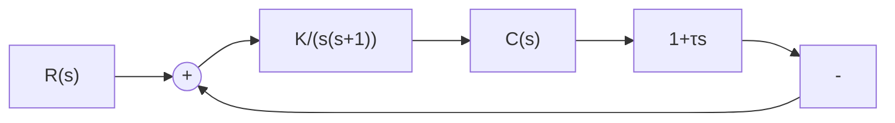

图 3-14 控制系统结构图

解 由图 3-14 知, 系统闭环传递函数为

$$\frac {C (s)}{R (s)} = \frac {K}{s ^ {2} + (1 + K \tau) s + K}$$

与传递函数标准形式(3-11)相比,可得

$$\omega_ {n} = \sqrt {K}, \quad \zeta = \frac {1 + K \tau}{2 \sqrt {K}}$$

由 $\zeta$ 与 $\sigma\%$ 的关系式(3-21)，解得

$$\zeta = \frac {\ln (1 / \sigma_ {p})}{\sqrt {\pi^ {2} + \left(\ln \frac {1}{\sigma_ {p}}\right) ^ {2}}} = 0. 4 6$$

再由峰值时间计算式(3-20)，算出

$$\omega_ {n} = \frac {\pi}{t _ {p} \sqrt {1 - \zeta^ {2}}} = 3. 5 4 \mathrm{rad/s}$$

从而解得

$$K = \omega_ {n} ^ {2} = 1 2. 5 3 (\mathrm{rad/s}) ^ {2}, \quad \tau = \frac {2 \zeta \omega_ {n} - 1}{K} = 0. 1 8 \mathrm{s}$$

由于

$$\beta = \arccos \zeta = 1. 0 9 \mathrm{rad}, \quad \omega_ {d} = \omega_ {n} \sqrt {1 - \zeta^ {2}} = 3. 1 4 \mathrm{rad/s}$$

故由式(3-19)和式(3-22)计算得

$$t _ {r} = \frac {\pi - \beta}{\omega_ {d}} = 0. 6 5 \mathrm{s}, \quad t _ {s} = \frac {3 . 5}{\zeta \omega_ {n}} = 2. 1 5 \mathrm{s}$$

若取误差带 $\Delta=0.02$ ，则调节时间为

$$t _ {s} = \frac {4 . 4}{\zeta \omega_ {n}} = 2. 7 0 \mathrm{s}$$
