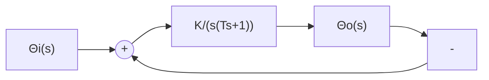

# (2) 调节时间 $t_{s}$ 的计算

根据式(3-17)，令 $T_{1} / T_{2}$ 为不同值，可以解出相应的无因次调节时间 $t_s / T_1$ ，如图3-16所示。图中阻尼比 $\zeta$ 为参变量。由于

$$s ^ {2} + 2 \zeta \omega_ {n} s + \omega_ {n} ^ {2} = (s + 1 / T _ {1}) (s + 1 / T _ {2})$$

因而 $\zeta$ 与自变量 $T_{1} / T_{2}$ 的关系式为

$$\zeta = \frac {1 + (T _ {1} / T _ {2})}{2 \sqrt {T _ {1} / T _ {2}}} \tag {3-25}$$

line

| ζ | ωₙIᵣ |
| --- | --- |
| 1.0 | 3.5 |
| 1.2 | 4.5 |
| 1.4 | 5.5 |
| 1.6 | 6.5 |
| 1.8 | 7.5 |
| 2.0 | 8.5 |
| 2.2 | 9.5 |
| 2.4 | 10.5 |
| 2.6 | 11.5 |
| 2.8 | 12.5 |
| 3.0 | 13.0 |

图 3-15 过阻尼二阶系统 $\omega_{n}t_{r}$ 与 $\zeta$ 的关系曲线

line

| T₁/T₂ | τₜ/T₁ |
| --- | --- |
| 1 | 4.6 |
| 3 | 3.6 |
| 5 | 3.3 |
| 7 | 3.2 |
| 9 | 3.1 |
| 11 | 3.1 |
| 13 | 3.1 |
| 15 | 3.1 |
| 17 | 3.05 |
| 19 | 3.05 |

图 3-16 过阻尼二阶系统的调节时间特性

当 $\zeta > 1$ 时，由已知的 $T_{1}$ 及 $T_{2}$ 值在图3-16上可以查出相应的 $t_{s}$ ；若 $T_{1} \geqslant 4T_{2}$ ，即过阻尼二阶系统第二个闭环极点的数值比第一个闭环极点的数值大四倍以上时，系统可等效为具有 $-1 / T_{1}$ 闭环极点的一阶系统，此时取 $t_{s} = 3T_{1}$ ，相对误差不超过 $10\%$ 。当 $\zeta = 1$ 时，由于 $T_{1} / T_{2} = 1$ ，由图3-16可见，临界阻尼二阶系统的调节时间

$$t _ {s} = 4. 7 5 T _ {1}, \quad \zeta = 1 \tag {3-26}$$

例 3-2 设角度随动系统如图 3-17 所示。图中，K 为开环增益，T=0.1s 为伺服电动机时间常数。若要求系统的单位阶跃响应无超调，且调节时间 $t_{s}\leqslant1s$ ，问 K 应取多大？此时系统的上升时间 $t_{r}$ 等于多少？

解 根据题意并考虑有尽量快的响应速度,应取阻尼比 $\zeta=1$ 。由图 3-17 得闭环特征方程为

flowchart

图 3-17 角度随动系统

$$s ^ {2} + \frac {1}{T} s + \frac {K}{T} = 0$$

代入 $T = 0.1$ ，可知在 $\zeta = 1$ 时，必有 $\omega_{n} = \sqrt{10K} = 5\mathrm{rad / s}$ ，解得开环增益 $K = 2.5(\mathrm{rad / s})^2$ 。因为 $\omega_{n}^{2} = 1 / T_{1}T_{2}$ ，而在 $\zeta = 1$ 时， $T_{1} = T_{2}$ ，所以得 $T_{1} = T_{2} = 0.2s$ ，从而由式(3-26)算得调节时间 $t_s = 4.75T_1 = 0.95(s)$ ，满足指标要求。

根据 $\zeta = 1$ 和 $\omega_{n} = 5\mathrm{rad / s}$ ，利用式(3-24)算得

$$t _ {r} = \frac {1 + 1 . 5 \zeta + \zeta^ {2}}{\omega_ {n}} = 0. 7 0 \mathrm{s}$$
