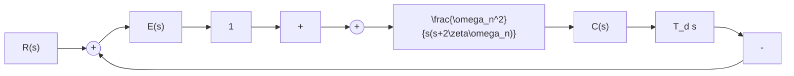

# (1) 比例-微分控制

设比例-微分控制的二阶系统如图3-21所示。图中， $E(s)$ 为误差信号， $T_{d}$ 为微分器时间常数。由图可见，系统输出量同时受误差信号及其速率的双重作用。因此，比例-微分控制是一种早期控制，可在出现位置误差前，提前产生修正作用，从而达到改善系统性能的目的。

flowchart

图 3-21 比例-微分控制系统

下面先从物理概念，并用分析方法，说明比例-微分控制可以改善系统动态性能而不影响常值稳态误差的原因。

line

| t | c(t) |
| --- | --- |
| 0 | 0 |
| t₁ | ~0.8 |
| t₂ | ~1.2 |
| t₃ | ~0.6 |
| t₄ | ~0.4 |
| t₅ | ~0.8 |
| t | 1 |

line

| t | e(t) |
| --- | --- |
| t₁ | 1 |
| t₂ | -1 |
| t₃ | 0 |
| t₄ | 1 |
| t₅ | 0 |

line

| t | ê(t) |
| --- | --- |
| 0 | 0 |
| t₁ | -1 |
| t₂ | 0 |
| t₃ | 1 |
| t₄ | -1 |
| t₅ | 0 |

图3-22 波形图

图3-22是表明比例-微分控制的波形图。设其中图(a)为比例控制时的单位阶跃响应，图(b)和(c)为相应的误差信号和误差速率信号。假定系统超调量大，且采用伺服电动机作为执行元件。当 $t \in [0, t_1)$ 时，由于系统阻尼小，电动机产生的修正转矩过大，使输出量超过希望值，此时误差信号为正；当 $t \in [t_1, t_3)$ 时，电动机转矩反向，起制动作用，力图使输出量回到希望值，但由于惯性及制动转矩不够大，输出量不能停留在希望值上，此时误差信号为负；当 $t \in [t_3, t_5)$ 时，电动机修正转矩重新为正，此时误差信号也是正值，力图使输出量的下降趋势减小，以利于恢复到希望值。由于系统稳定，所以误差幅值在每一次振荡过程中均有所减小，输出量最后会趋于希望值，但动态过程不理想。如果在 $t \in [0, t_2)$ 内，减小正向修正转矩，增大反向制动转矩；同时，在 $t \in [t_2, t_4)$ 内，减小反向制动转矩，增大正向修正转矩，则可以显著改善系统动态性能。比例-微分控制器中的微分部分，正可以起这种期望作用。伺服电动机在比例-微分控制器作用下产生的转矩，正比于 $e(t) + T_d \dot{e}(t)$ 。由图3-22的(b)和(c)可见，对于 $t \in [0, t_1), \dot{e}(t) < 0$ ，故 $e(t) + T_d \dot{e}(t) < e(t)$ ，使得电动机产生的正向修正转矩减小；对于 $t \in [t_1, t_2), e(t) < 0$ 且 $\dot{e}(t) < 0$ ，故电动机产生的反向制动转矩比纯比例控制时为大，系统超调量将会减小；对于 $t \in [t_2, t_3), e(t) < 0$ 但 $\dot{e}(t) > 0$ ，故电动机产生的制动转矩要减小，有利于输出量尽快地达到稳态值。由于 $\dot{e}(t)$ 只反映误差信号变化的速率，所以微分控制部分并不影响系统的常值稳态误差。但是，它相当于增大系统的阻尼，从而容许选用较大的开环增益，改善系统的动态性能和稳态精度。

下面，用分析方法研究比例-微分控制对系统性能的影响。由图3-21易得其开环传递函数

$$G (s) = \frac {C (s)}{E (s)} = \frac {K (T _ {d} s + 1)}{s (s / 2 \zeta \omega_ {n} + 1)} \tag {3-39}$$

式中， $K=\omega_{n}/2\zeta$ ，称为开环增益。若令 $z=1/T_{d}$ ，则闭环传递函数为
