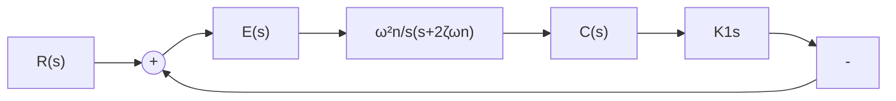
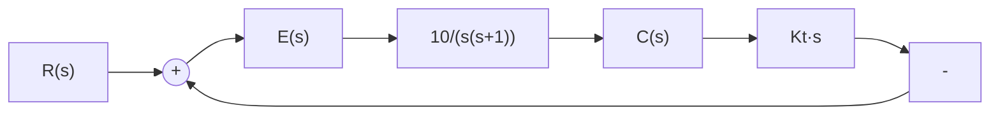

# (2) 测速反馈控制

输出量的导数同样可以用来改善系统的性能。通过将输出的速度信号反馈到系统输入端，并与误差信号比较，其效果与比例-微分控制相似，可以增大系统阻尼，改善系统动态性能。

flowchart

图 3-24 测速反馈控制的二阶系统

由图 3-24, 系统的开环传递函数为

如果系统输出量是机械位置,如角位移,则可以采用测速发电机将角位移变换为正比于角速度的电压,从而获得输出速度反馈。图 3-24 是采用测速发电机反馈的二阶系统结构图。图中, $K_{t}$ 为与测速发电机输出斜率有关的测速反馈系数,通常采用(电压/单位转速)单位。

$$G (s) = \frac {\omega_ {n}}{2 \zeta + K _ {t} \omega_ {n}} \cdot \frac {1}{s [ s / (2 \zeta \omega_ {n} + K _ {t} \omega_ {n} ^ {2}) + 1 ]} \tag {3-50}$$

式中开环增益为

$$K = \frac {\omega_ {n}}{2 \zeta + K _ {t} \omega_ {n}} \tag {3-51}$$

相应的闭环传递函数为

$$\Phi (s) = \frac {\omega_ {n} ^ {2}}{s ^ {2} + 2 \zeta_ {t} \omega_ {n} s + \omega_ {n} ^ {2}} \tag {3-52}$$

式中

$$\zeta_ {t} = \zeta + \frac {1}{2} K _ {t} \omega_ {n} \tag {3-53}$$

由式(3-51)～式(3-53)可见,测速反馈与比例-微分控制不同的是,测速反馈会降低系统的开环增益,从而加大系统在斜坡输入时的稳态误差;相同的则是,同样不影响系统的自然频率,并可增大系统的阻尼比。为了便于比较,将式(3-41)写为

$$\zeta_ {d} = \zeta + \frac {1}{2} T _ {d} \omega_ {n} \tag {3-54}$$

比较式(3-53)和式(3-54)可见,它们的形式是类似的,如果在数值上有 $K_{t}=T_{d}$ ,则 $\zeta_{t}=\zeta_{d}$ 。因此可以预料,测速反馈同样可以改善系统的动态性能。但是,由于测速反馈不形成闭环零点,因此即便在 $K_{t}=T_{d}$ 情况下,测速反馈与比例-微分控制对系统动态性能的改善程度也是不同的。

在设计测速反馈控制系统时,可以适当增大原系统的开环增益,以弥补稳态误差的损失,同时适当选择测速反馈系数 $K_{t}$ ,使阻尼比 $\zeta_{t}$ 在 0.4\~0.8 之间,从而满足给定的各项动态性能指标。

例 3-5 设控制系统如图 3-25 所示。其中(a)为比例控制系统，(b)为测速反馈控制系统。试确定使系统阻尼比为 0.5 的 $K_{t}$ 值，并计算系统(a)和(b)的各项性能指标。

flowchart

(a)

flowchart

(b)   
图 3-25 控制系统

解 系统(a)的闭环传递函数为

$$\Phi (s) = \frac {1 0}{s ^ {2} + s + 1 0}$$

因而， $\zeta = 0.16, \omega_n = 3.16\mathrm{rad / s}$ 。在单位斜坡函数作用下，稳态误差 $e_s(\infty) = 1 / K = 0.1\mathrm{rad}$ ；在单

位阶跃函数作用下，其动态性能

$$t _ {r} = 0. 5 5 \mathrm{s}, \quad t _ {p} = 1. 0 1 \mathrm{s}\sigma \% = 60.4 \%, \quad t _ {s} = 7 s$$

系统(b)的闭环传递函数为

$$\Phi (s) = \frac {1 0}{s ^ {2} + (1 + 1 0 K _ {t}) s + 1 0}$$

由式(3-53)算出

$$K _ {t} = \frac {2 (\zeta_ {t} - \zeta)}{\omega_ {n}} = 0. 2 2$$

其中， $\zeta_t = 0.5, \omega_n = 3.16\mathrm{rad / s}$ 。再由式(3-51)得开环增益 $K = 3.16$ 。于是

$$e _ {s} (\infty) = 0. 3 2 \mathrm{rad}, \quad t _ {r} = 0. 7 7 \mathrm{s}, \quad t _ {p} = 1. 1 5 \mathrm{s}\sigma \% = 16.3 \%, \quad t _ {s} = 2.22 \mathrm{s}$$

上例表明,测速反馈可以改善系统动态性能,但会增大稳态误差。为了减小稳态误差,必须加大原系统的开环增益,而使 $K_{t}$ 单纯用来增大系统阻尼。
