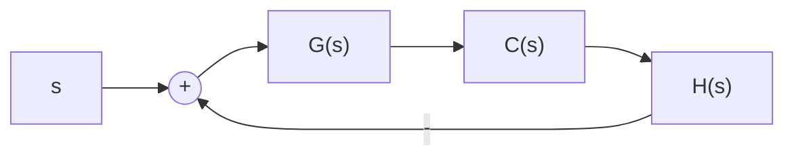

# 2. 高阶系统的单位阶跃响应

flowchart

图 3-27 控制系统

研究图 3-27 所示系统, 其闭环传递函数为

$$\Phi (s) = \frac {C (s)}{R (s)} = \frac {G (s)}{1 + G (s) H (s)} \tag {3-60}$$

在一般情况下， $G(s)$ 和 $H(s)$ 都是 $s$ 的多项式之比，故式(3-60)可以写为

$$\Phi (s) = \frac {M (s)}{D (s)} = \frac {b _ {0} s ^ {m} + b _ {1} s ^ {m - 1} + \cdots + b _ {m - 1} s + b _ {m}}{a _ {0} s ^ {n} + a _ {1} s ^ {n - 1} + \cdots + a _ {n - 1} s + a _ {n}}, \quad m \leqslant n \tag {3-61}$$

利用 MATLAB 软件可以方便地求出式(3-61)所示高阶系统的单位阶跃响应, 即先建立其高阶系统模型, 再直接调用 step 命令即可。一般命令语句如下:

$$\mathrm{sys} = \mathrm{tf} ([ \mathrm{b0} \quad \mathrm{b1} \quad \mathrm{b2} \quad \mathrm{b3} \quad \dots \quad \mathrm{bm} ], [ \mathrm{a0} \quad \mathrm{a1} \quad \mathrm{a2} \quad \mathrm{a3} \quad \dots \quad \mathrm{an} ]); \quad \% \text {高阶系统建模}\text {step(sys)}; \quad \% \text {计算单位阶跃响应}$$

其中，b0, b1, b2, b3, …, bm 表示式(3-61)对应的分子多项式系数；a0, a1, a2, a3, …, an 表示式(3-61)对应的分母多项式系数。

当采用解析法求解高阶系统的单位阶跃响应时，应将式(3-61)的分子多项式和分母多项式进行因式分解，再进行拉氏反变换。这种分解方法，可采用高次代数方程的近似求根法，也可以使用MATLAB中的tf2zp命令。因此，式(3-61)必定可以表示为如下因式的乘积形式：

$$\Phi (s) = \frac {C (s)}{R (s)} = \frac {M (s)}{D (s)} = \frac {K \prod_ {i = 1} ^ {m} (s - z _ {i})}{\prod_ {i = 1} ^ {n} (s - s _ {i})} \tag {3-62}$$

式中， $K=b_{0}/a_{0}$ ; $z_{i}$ 为 $M(s)=0$ 之根，称为闭环零点； $s_{i}$ 为 $D(s)=0$ 之根，称为闭环极点。

例 3-6 设三阶系统闭环传递函数为

$$\Phi (s) = \frac {5 (s ^ {2} + 5 s + 6)}{s ^ {3} + 6 s ^ {2} + 1 0 s + 8}$$

试确定其单位阶跃响应。

解 将已知的 $\Phi(s)$ 进行因式分解, 可得

$$\Phi (s) = \frac {5 (s + 2) (s + 3)}{(s + 4) (s ^ {2} + 2 s + 2)}$$

由于 $R(s) = 1 / s$ ，所以

$$C (s) = \frac {5 (s + 2) (s + 3)}{s (s + 4) (s ^ {2} + 2 s + 2)}$$

其部分分式为

$$C (s) = \frac {A _ {0}}{s} + \frac {A _ {1}}{s + 4} + \frac {A _ {2}}{s + 1 + j} + \frac {\overline {{{A}}} _ {2}}{s + 1 - j}$$

式中， $A_{2}$ 与 $\overline{A}_2$ 共轭。可以算出：

$$A _ {0} = \frac {1 5}{4}, \quad A _ {1} = - \frac {1}{4}, \quad A _ {2} = \frac {1}{4} (- 7 + j), \quad \overline {{{{A}}}} _ {2} = \frac {1}{4} (- 7 - j)$$

对部分分式进行拉氏反变换，并设初始条件全部为零，得高阶系统的单位阶跃响应

$$c (t) = \frac {1}{4} \left[ 1 2 - \mathrm{e} ^ {- 4 t} - 1 0 \sqrt {2} \mathrm{e} ^ {- t} \cos (t + 3 5 2 ^ {\circ}) \right]$$

另外，若借助于MATLAB软件，本例题求解过程的MATLAB文本如下：
