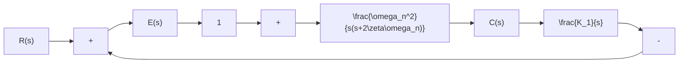

# 5. 劳斯稳定判据的应用

在线性控制系统中，劳斯判据主要用来判断系统的稳定性。如果系统不稳定，则这种判据并不能直接指出使系统稳定的方法；如果系统稳定，则劳斯判据也不能保证系统具备满意的动态性能。换句话说，劳斯判据不能表明系统特征根在 $s$ 平面上相对于虚轴的距离。由高阶系统单位脉冲响应表达式(3-67)可见，若负实部特征方程式的根紧靠虚轴，则由于 $\left|s_{j}\right|$ 或 $\zeta_{k}\omega_{k}$ 的值很小，系统动态过程将具有缓慢的非周期特性或强烈的振荡特性。为了使稳定的系统具有良好的动态响应，我们常常希望在 $s$ 左半平面上系统特征根的位置与虚轴之间有一定的距离。为此，可在 $s$ 左半平面上作一条 $s = -a$ 的垂线，而 $a$ 是系统特征根位置与虚轴之间的最小给定距离，通常称为给定稳定度，然后用新变量 $s_1 = s + a$ 代入原系统特征方程，得到一个以 $s_1$ 为变量的新特征方程，对新特征方程应用劳斯稳定判据，可以判别系统的特征根是否全部位于 $s = -a$ 垂线之左。此外，应用劳斯稳定判据还可以确定系统一个或两个可调参数对系统稳定性的影响，即确定一个或两个使系统稳定，或使系统特征根全部位于 $s = -a$ 垂线之左的参数取值范围。

例 3-11 设比例-积分(PI)控制系统如图 3-32 所示。其中， $K_{1}$ 为与积分器时间常数有关的待定参数。已知参数 $\zeta=0.2$ 及 $\omega_{n}=86.6$ ，试用劳斯稳定判据确定使闭环系统稳定的 $K_{1}$ 取值范围。如果要求闭环系统的极点全部位于 s=-1 垂线之左，问 $K_{1}$ 值范围又应取多大？

flowchart

图 3-32 比例-积分控制系统

解 根据图3-32可写出系统的闭环传递函数

$$\Phi (s) = \frac {\omega_ {n} ^ {2} (s + K _ {1})}{s ^ {3} + 2 \zeta \omega_ {n} s ^ {2} + \omega_ {n} ^ {2} s + K _ {1} \omega_ {n} ^ {2}}$$

因而，闭环特征方程为

$$D (s) = s ^ {3} + 2 \zeta \omega_ {n} s ^ {2} + \omega_ {n} ^ {2} s + K _ {1} \omega_ {n} ^ {2} = 0$$

代入已知的 $\zeta$ 与 $\omega_{n}$ ，得

$$D (s) = s ^ {3} + 3 4. 6 s ^ {2} + 7 5 0 0 s + 7 5 0 0 K _ {1} = 0$$

列出相应的劳斯表：

$$
\begin{array}{c c c} s ^ {3} & 1 & 7 5 0 0 \\ s ^ {2} & 3 4. 6 & 7 5 0 0 K _ {1} \\ s ^ {1} & \frac {3 4 . 6 \times 7 5 0 0 - 7 5 0 0 K _ {1}}{3 4 . 6} & 0 \\ s ^ {0} & 7 5 0 0 K _ {1} \end{array}
$$

根据劳斯稳定判据，令劳斯表中第一列各元为正，求得 $K_{1}$ 的取值范围为

$$0 < K _ {1} < 3 4. 6$$

当要求闭环极点全部位于 s=-1 垂线之左时，可令 $s=s_{1}-1$ ，代入原特征方程，得到新特征方程

$$(s _ {1} - 1) ^ {3} + 3 4. 6 (s _ {1} - 1) ^ {2} + 7 5 0 0 (s _ {1} - 1) + 7 5 0 0 K _ {1} = 0$$

整理得

$$s _ {1} ^ {3} + 3 1. 6 s _ {1} ^ {2} + 7 4 3 3. 8 s _ {1} + (7 5 0 0 K _ {1} - 7 4 6 6. 4) = 0$$

相应的劳斯表为

$$
\begin{array}{c c c} s _ {1} ^ {3} & 1 & 7 4 3 3. 8 \\ s _ {1} ^ {2} & 3 1. 6 & 7 5 0 0 K _ {1} - 7 4 6 6. 4 \\ s _ {1} ^ {1} & \frac {3 1 . 6 \times 7 4 3 3 . 8 - (7 5 0 0 K _ {1} - 7 4 6 6 . 4)}{3 1 . 6} & 0 \\ s _ {1} ^ {0} & 7 5 0 0 K _ {1} - 7 4 6 6. 4 \end{array}
$$

令劳斯表中第一列各元为正，得使全部闭环极点位于 $s = -1$ 垂线之左的 $K_{1}$ 取值范围：

$$1 < K _ {1} < 3 2. 3$$

如果需要确定系统其他参数,例如时间常数对系统稳定性的影响,方法是类似的。一般说来,这种待定参数不能超过两个。有关系统稳定性分析及参数选择对系统稳定性的影响问题,可以利用 MATLAB 软件包来解决,请参见本书附录 B。
