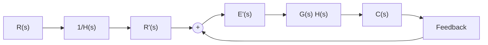

# 1. 误差与稳态误差

设控制系统结构图如图 3-27 所示。当输入信号 $R(s)$ 与主反馈信号 $B(s)$ 不等时，比较装置的输出为

$$E (s) = R (s) - H (s) C (s) \tag {3-69}$$

此时，系统在 $E(s)$ 信号作用下产生动作，使输出量趋于希望值。通常，称 $E(s)$ 为误差信号，简称误差（亦称偏差）。

误差有两种不同的定义方法：一种是式(3-69)所描述的在系统输入端定义误差的方法；另一种是从系统输出端来定义，它定义为系统输出量的希望值与实际值之差。前者定义的误差，在实际系统中是可以量测的，具有一定的物理意义；后者定义的误差，在系统性能指标的提法中经常使用，但在实际系统中有时无法量测，因而一般只有数学意义。

flowchart

图 3-33 等效单位反馈系统

上述两种定义误差的方法,存在着内在联系。将图 3-27 变换为图 3-33 的等效形式,则因 $R'(s)$ 代表输出量的希望值,因而 $E'(s)$ 是从系统输出端定义的非单位反馈系统的误差。不难证明, $E(s)$ 与 $E'(s)$ 之间存在如下简单关系:

$$E ^ {\prime} (s) = \frac {E (s)}{H (s)} \tag {3-70}$$

所以，在本书以下的叙述中，均采用从系统输入端定义的误差 $E(s)$ 来进行计算和分析。如果有必要计算输出端误差 $E'(s)$ ，可利用式(3-70)进行换算。特别指出，对于单位反馈控制系统，输出量的希望值就是输入信号 $R(s)$ ，因而两种误差定义的方法是一致的。

误差本身是时间的函数,其时域表达式为

$$e (t) = \mathcal {L} ^ {- 1} [ E (s) ] = \mathcal {L} ^ {- 1} [ \Phi_ {e} (s) R (s) ] \tag {3-71}$$

式中， $\Phi_{e}(s)$ 为系统误差传递函数，由下式决定：

$$\Phi_ {e} (s) = \frac {E (s)}{R (s)} = \frac {1}{1 + G (s) H (s)} \tag {3-72}$$

在误差信号 $e(t)$ 中，包含瞬态分量 $e_{ts}(t)$ 和稳态分量 $e_{ss}(t)$ 两部分。由于系统必须稳定，故当时间趋于无穷时，必有 $e_{ts}(t)$ 趋于零。因此，控制系统的稳态误差定义为误差信号 $e(t)$ 的稳态分量 $e_{ss}(\infty)$ ，常以 $e_{s}$ 简单标志。

如果有理函数 $sE(s)$ 除在原点处有唯一的极点外，在 $s$ 右半平面及虚轴上解析，即 $sE(s)$ 的极点均位于 $s$ 左半平面（包括坐标原点），则可根据拉氏变换的终值定理，由式(3-72)方便地求出系统的稳态误差：

$$e _ {s} (\infty) = \lim _ {s \to 0} s E (s) = \lim _ {s \to 0} \frac {s R (s)}{1 + G (s) H (s)} \tag {3-73}$$

由于上式算出的稳态误差是误差信号稳态分量 $e_{s}(t)$ 在 $t$ 趋于无穷时的数值，故有时称之为终值误差，它不能反映 $e_{s}(t)$ 随时间 $t$ 的变化规律，具有一定的局限性。

例 3-12 设单位反馈系统的开环传递函数为 $G(s)=1/Ts$ ，输入信号分别为 $r(t)=t^{2}/2$ 以及

$r(t)=\sin\omega t$ ，试求控制系统的稳态误差。

解 当 $r(t) = t^2 / 2$ 时, $R(s) = 1 / s^3$ 。由式(3-72)求得

$$E (s) = \frac {1}{s ^ {2} (s + 1 / T)} = \frac {T}{s ^ {2}} - \frac {T ^ {2}}{s} + \frac {T ^ {2}}{s + 1 / T}$$

显然， $sE(s)$ 在 $s = 0$ 处，有一个极点。对上式取拉氏反变换，得误差响应

$$e (t) = T ^ {2} \mathrm{e} ^ {- t / T} + T (t - T)$$

式中， $e_{s}(t) = T^{2}\mathrm{e}^{-t / T}$ ，随时间增长逐渐衰减至零； $e_{s}(t) = T(t - T)$ ，表明稳态误差 $e_{s}(\infty) = \infty$ 。

当 $r(t) = \sin \omega t$ 时， $R(s) = \omega / (s^2 + \omega^2)$ 。由于
