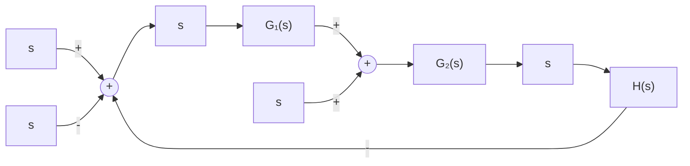
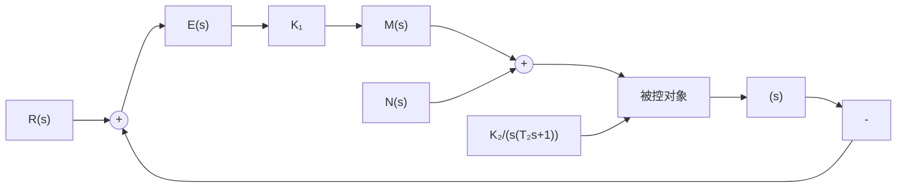

# 7. 扰动作用下的稳态误差

控制系统除承受输入信号作用外，还经常处于各种扰动作用之下。例如：负载转矩的变动、放大器的零位和噪声、电源电压和频率的波动、组成元件的零位输出，以及环境温度的变化等。因此，控制系统在扰动作用下的稳态误差值，反映了系统的抗干扰能力。在理想情况下，系统对于任意形式的扰动作用，其稳态误差应该为零，但实际上这是不能实现的。

flowchart

图 3-37 控制系统

由于输入信号和扰动信号作用于系统的不同位置,因而即使系统对于某种形式输入信号作用的稳态误差为零,但对于同一形式的扰动作用,其稳态误差未必为零。设控制系统如图3-37所示,其中 $N(s)$ 代表扰动信号的拉氏变换式。由于在扰动信号 $N(s)$ 作用下系统的理想输出应为零,故该非单位反馈系统响应扰

动 $n(t)$ 的输出端误差信号为

$$E _ {n} (s) = - C _ {n} (s) = - \frac {G _ {2} (s)}{1 + G (s)} N (s) \tag {3-91}$$

式中， $G(s) = G_{1}(s)G_{2}(s)H(s)$ 为非单位反馈系统的开环传递函数， $G_{2}(s)$ 为以 $n(t)$ 为输入， $c_{n}(t)$ 为输出时非单位反馈系统前向通道的传递函数。

记

$$\Phi_ {e n} (s) = - \frac {G _ {2} (s)}{1 + G (s)} \tag {3-92}$$

为系统对扰动作用的误差传递函数，并将其在 s=0 的邻域展成泰勒级数，则式(3-93)可表示为

$$\Phi_ {e n} (s) = \Phi_ {e n} (0) + \dot {\Phi} _ {e n} (0) s + \frac {1}{2 !} \ddot {\Phi} _ {e n} (0) s ^ {2} + \dots + \frac {1}{l !} \Phi_ {e n} ^ {(l)} (0) s ^ {l} + \dots \tag {3-93}$$

设系统扰动信号表示为

$$n (t) = n _ {0} + n _ {1} t + \frac {1}{2} n _ {2} t ^ {2} + \dots + \frac {1}{k !} n _ {k} t ^ {k} \tag {3-94}$$

则将式(3-93)代入式(3-91)，并取拉氏反变换，得稳定系统对扰动作用的稳态误差表达式

$$e _ {s n} (t) = \sum_ {i = 0} ^ {k} C _ {i n} n ^ {(i)} (t) \tag {3-95}$$

式中

$$C _ {i n} = \frac {1}{i !} \Phi_ {e n} ^ {(i)} (0); \quad i = 0, 1, 2, \dots \tag {3-96}$$

称为系统对扰动的动态误差系数。将 $\Phi_{m}(s)$ 的分子多项式与分母多项式按 s 的升幂排列，然后利用长除法，可以方便地求得 $C_{m}$ 。

当 $sE_{n}(s)$ 在 $s$ 右半平面及虚轴上解析时，同样可以采用终值定理法计算系统在扰动作用下的稳态误差。

例 3-16 设比例控制系统如图 3-38 所示。图中， $R(s)=R_{0}/s$ 为阶跃输入信号；M 为比例控制器

输出转矩,用以改变被控对象的位置; $N(s)=n_{0}/s$ 为阶跃扰动转矩。试求系统的稳态误差。

解 由图可见,本例系统为 I 型系统。令扰动 $N(s)=0$ , 则系统对阶跃输入信号的稳态误差为零。但是, 如果令 $R(s)=0$ , 则系统在扰动作用下输出量的实际值为

$$C _ {n} (s) = \frac {K _ {2}}{s (T _ {2} s + 1) + K _ {1} K _ {2}} N (s)$$

而输出量的希望值为零,因此误差信号

flowchart

图 3-38 比例控制系统

$$E _ {n} (s) = - \frac {K _ {2}}{s (T _ {2} s + 1) + K _ {1} K _ {2}} N (s)$$

系统在阶跃扰动转矩作用下的稳态误差

$$e _ {s s n} (\infty) = \lim _ {s \to 0} s E _ {n} (s) = - n _ {0} / K _ {1} \tag {3-97}$$

系统在阶跃扰动转矩作用下存在稳态误差的物理意义是明显的。稳态时，比例控制器产生一个与扰动转矩 $n_{0}$ 大小相等而方向相反的转矩 $-n_{0}$ 以进行平衡，该转矩折算到比较装置输出端的数值为 $-n_{0}/K_{1}$ ，所以系统必定存在常值稳态误差 $-n_{0}/K_{1}$ 。
