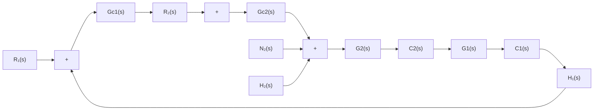
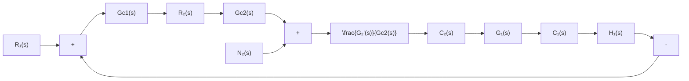

图 3-40 串级控制系统结构图

若将副回路视为一个等效环节 $G_2'(s)$ ，则有

$$G _ {2} ^ {\prime} (s) = \frac {C _ {2} (s)}{R _ {2} (s)} = \frac {G _ {c 2} (s) G _ {2} (s)}{1 + G _ {c 2} (s) G _ {2} (s) H _ {2} (s)}$$

在副回路中，输出 $C_2(s)$ 对二次扰动 $N_{2}(s)$ 的闭环传递函数为

$$G _ {n 2} (s) = \frac {C _ {2} (s)}{N _ {2} (s)} = \frac {G _ {2} (s)}{1 + G _ {c 2} (s) G _ {2} (s) H _ {2} (s)}$$

比较 $G_{2}^{\prime}(s)$ 与 $G_{n2}(s)$ 可见，必有

$$G _ {n 2} (s) = \frac {G _ {2} ^ {\prime} (s)}{G _ {c 2} (s)}$$

于是，图3-40所示串级系统结构图可等效为图3-41所示结构图。显然，在主回路中，系统对输

flowchart

图 3-41 串级控制系统的等效结构图

入信号的闭环传递函数为

$$\frac {C _ {1} (s)}{R _ {1} (s)} = \frac {G _ {c 1} (s) G _ {2} ^ {\prime} (s) G _ {1} (s)}{1 + G _ {c 1} (s) G _ {2} ^ {\prime} (s) G _ {1} (s) H _ {1} (s)}$$

系统对二次扰动信号 $N_{2}(s)$ 的闭环传递函数为

$$\frac {C _ {1} (s)}{N _ {2} (s)} = \frac {\left[ G _ {2} ^ {\prime} (s) / G _ {c 2} (s) \right] G _ {1} (s)}{1 + G _ {c 1} (s) G _ {2} ^ {\prime} (s) G _ {1} (s) H _ {1} (s)}$$

对于一个理想的控制系统,总是希望多项式比值 $C_{1}(s)/N_{2}(s)$ 趋于零,而 $C_{1}(s)/R_{1}(s)$ 趋于 1,因此串级控制系统抑制二次扰动 $N_{2}(s)$ 的能力可用下式表示:

$$\frac {C _ {1} (s) / R _ {1} (s)}{C _ {1} (s) / N _ {2} (s)} = G _ {c 1} (s) G _ {c 2} (s)$$

若主、副调节器均采用比例调节器，其增益分别为 $K_{c1}$ 和 $K_{c2}$ ，则上式可写为

$$\frac {C _ {1} (s) / R _ {1} (s)}{C _ {1} (s) / N _ {2} (s)} = K _ {c 1} K _ {c 2}$$

上式表明，主、副调节器的总增益越大，则串级系统抑制二次扰动 $N_{2}(s)$ 的能力越强。

由于在串级控制系统设计时副回路的阶数一般都取得较低，因而副调节器的增益 $K_{c2}$ 可以取得较大，通常满足

$$K _ {c 1} K _ {c 2} > K _ {c 1}$$

可见，与单回路控制系统相比，串级控制系统对二次扰动的抑制能力有很大的提高，一般可达10～100倍。
