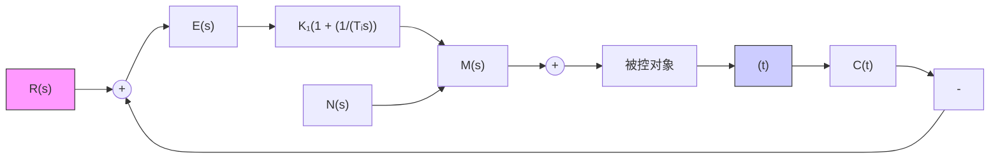

# (4) 采用复合控制方法

如果控制系统中存在强扰动,特别是低频强扰动,则一般的反馈控制方式难以满足高稳态精度的要求,此时可以采用复合控制方式。

复合控制系统是在系统的反馈控制回路中加入前馈通路，组成一个前馈控制与反馈控制相结合的系统，只要系统参数选择合适，不但可以保持系统稳定，极大地减小乃至消除稳态误差，而且可以抑制几乎所有的可量测扰动，其中包括低频强扰动。详见本书第六章。

例 3-17 如果在例 3-16 系统中采用比例-积分控制器, 如图 3-42 所示, 试分别计算系统在阶跃转矩扰动和斜坡转矩扰动作用下的稳态误差。

flowchart

图 3-42 比例-积分控制系统

解 由图3-42可知，在扰动作用点之前的积分环节数 $\nu_{1} = 1$ ，而 $\nu_{3} = 0$ ，故该比例-积分控制系统对扰动作用为I型系统，在阶跃扰动作用下不存在稳态误差，而在斜坡扰动作用下存在常值稳态误差。

由图 3-42 不难写出扰动作用下的系统误差表达式

$$E _ {n} (s) = - \frac {K _ {2} T _ {i} s}{T _ {1} T _ {2} s ^ {3} + T _ {i} s ^ {2} + K _ {1} K _ {2} T _ {i} s + K _ {1} K _ {2}} N (s)$$

设 $sE_{n}(s)$ 的极点位于 s 左半平面，则可用终值定理法求得稳态误差。

当 $N(s) = n_0 / s$ 时

$$e _ {s m} (\infty) = \lim _ {s \rightarrow 0} s E _ {n} (s) = - \lim _ {s \rightarrow 0} \frac {n _ {0} K _ {2} T _ {i} s}{T _ {i} T _ {2} s ^ {3} + T _ {i} s ^ {2} + K _ {1} K _ {2} T _ {i} s + K _ {1} K _ {2}} = 0$$

当 $N(s) = n_{1} / s^{2}$ 时

$$e _ {s m} (\infty) = - \lim _ {s \rightarrow 0} \frac {n _ {1} K _ {2} T _ {i}}{T _ {i} T _ {2} s ^ {3} + T _ {i} s ^ {2} + K _ {1} K _ {2} T _ {i} s + K _ {1} K _ {2}} = - \frac {n _ {1} T _ {i}}{K _ {1}}$$

显然，提高比例增益 $K_{1}$ 可以减小斜坡转矩作用下的稳态误差，但 $K_{1}$ 的增大要受到稳定性要求和动态过程振荡性要求的制约。

系统采用比例-积分控制器后,可以消除阶跃扰动转矩作用下稳态误差,其物理意义是清楚的:由于控制器中包含积分控制作用,只要稳态误差不为零,控制器就一定会产生一个继续增长的输出转矩来抵消阶跃扰动转矩的作用,力图减小这个误差,直到稳态误差为零,系统取得平衡而进入稳态。在斜坡转矩扰动作用下,系统存在常值稳态误差的物理意义可以这样解释:由于转矩扰动是斜坡函数,因此需要控制器在稳态时输出一个反向的斜坡转矩与之平衡,这只有在控制器输入的误差信号为一负常值时才有可能。

实际系统总是同时承受输入信号和扰动作用的。由于所研究的系统为线性定常控制系统，因此系统总的稳态误差将等于输入信号和扰动分别作用于系统时，所得的稳态误差的绝对值和。如果给出系统相应的时间响应，则系统的稳态误差是一目了然的，因此可以应用 MATLAB 软件包验证和分析系统稳态误差的计算结果。
