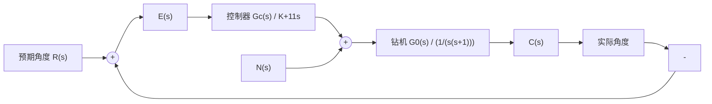

# 例 3-18 海底隧道钻机控制系统

连接法国和英国的英吉利海峡海底隧道于1987年12月开工建设，1990年11月，从两个国家分头开钻的隧道首次对接成功。隧道长37.82km，位于海底面以下61m。隧道于1992年完工，共耗资14亿美元，每天能通过50辆列车，从伦敦到巴黎的火车行车时间缩短为3h。

钻机在推进过程中,为了保证必要的隧道对接精度,施工中使用了一个激光导引系统,以保持钻机的直线方向。钻机控制系统如图3-43所示。图中,C(s)为钻机向前的实际角度,R(s)为预期角度,N(s)为负载对机器的影响。

flowchart

图 3-43 钻机控制系统

该系统设计目的是选择增益 K，使系统对输入角度的响应满足工程要求，并且使扰动引起的稳态误差较小。

解 该钻机控制系统采用了比例-微分(PD)控制。应用梅森增益公式,可得系统在 $R(s)$ 和

$N(s)$ 同时作用下的输出为

$$C (s) = \frac {K + 1 1 s}{s ^ {2} + 1 2 s + K} R (s) - \frac {1}{s ^ {2} + 1 2 s + K} N (s)$$

显然，闭环系统特征方程为

$$s ^ {2} + 1 2 s + K = 0$$

因此，只要选择 K>0，闭环系统一定稳定。

由于系统在扰动 $N(s)$ 作用下的闭环传递函数为

$$\Phi_ {n} (s) = \frac {C _ {n} (s)}{N (s)} = - \frac {1}{s ^ {2} + 1 2 s + K}$$

令 $N(s) = \frac{1}{s}$ ，可得单位阶跃扰动作用下系统的稳态输出

$$c _ {n} (\infty) = \lim _ {s \rightarrow 0} \Phi_ {n} (s) N (s) = - \frac {1}{K}$$

若选 $K > 10$ ，则 $\left|c_{n}(\infty)\right| < 0.1$ ，可以减小扰动的影响。因而，从系统稳态性能考虑，以取 $K > 10$ 为宜。

为了选择适当的 K 值,需要分析比例-微分控制的作用。如果仅选用比例(P)控制,则系统的开环传递函数

$$G _ {c} (s) G _ {0} (s) = \frac {K}{s (s + 1)}$$

相应的闭环传递函数

$$\Phi (s) = \frac {K}{s ^ {2} + s + K} = \frac {\omega_ {n} ^ {2}}{s ^ {2} + 2 \zeta \omega_ {n} s + \omega_ {n} ^ {2}}$$

可得系统无阻尼自然频率与阻尼比分别为

$$\omega_ {n} = \sqrt {K}, \quad \zeta = \frac {1}{2 \sqrt {K}}$$

如果选用 PD 控制, 系统的开环传递函数

$$G _ {c} (s) G _ {0} (s) = \frac {K + 1 1 s}{s (s + 1)} = \frac {K (T _ {d} s + 1)}{s (s / 2 \zeta_ {d} \omega_ {n} + 1)}$$

式中， $T_{d}=\frac{11}{K}$ ; $2\zeta_{d}\omega_{n}=1$ 。相应的闭环传递函数

$$\Phi (s) = \frac {K + 1 1 s}{s ^ {2} + 1 2 s + K} = \frac {\omega_ {n} ^ {2}}{z} \left(\frac {s + z}{s ^ {2} + 2 \zeta_ {d} \omega_ {n} s + \omega_ {n} ^ {2}}\right)$$

式中， $z = \frac{1}{T_d} = \frac{K}{11}$ 为闭环零点，而

$$\omega_ {n} = \sqrt {K}, \quad \zeta_ {d} = \zeta + \frac {\omega_ {n}}{2 z} = \frac {1 2}{2 \sqrt {K}}$$

表明引入微分控制可以增大系统阻尼，改善系统动态性能。

1) 取 $K = 100$ ，则 $\omega_{n} = 10, e_{\mathrm{sn}}(\infty) = -0.01$ 。

P 控制时： $\zeta = \frac{1}{2\omega_n} = 0.05$

动态性能 $\sigma \% = 100\mathrm{e}^{-\pi \zeta / \sqrt{1 - \zeta^2}}\% = 85.4\%$
