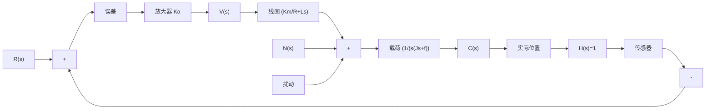
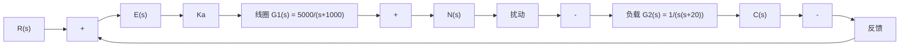

# 例 3-19 磁盘驱动读取系统(续)

磁盘驱动器必须保证磁头的精确位置，并减小参数变化和外部振动对磁头定位造成的影响。作用于磁盘驱动器的扰动包括物理振动、磁盘转轴轴承的磨损和摆动，以及元器件老化引起的参数变化等。设图3-46磁盘驱动系统在考虑扰动作用时的结构如图3-47所示，根据表2-3给定的参数，图3-47可表示为图3-48所示。试讨论放大器增益 $K_{a}$ 值的选取对系统在单位阶跃指令作用下的动态响应、稳态误差以及抑制扰动能力的影响。

text_image

磁盘
读/写磁头
期望位置
传感器
控制器
电机输入

图 3-46 磁盘驱动控制系统示意图

flowchart

图 3-47 磁盘驱动器磁头控制系统

flowchart

图 3-48 磁头控制系统结构图

解 1) 当 $N(s) = 0, R(s) = 1 / s$ 时。误差信号

$$E (s) = \frac {1}{1 + K _ {a} G _ {1} (s) G _ {2} (s)} R (s)$$

于是 $\lim_{t\to \infty}e(t) = \lim_{s\to 0}\left[\frac{1}{1 + K_aG_1(s)G_2(s)}\right]\frac{1}{s} = 0$

上式表明系统在单位阶跃输入作用下的稳态跟踪误差为零。这一结论与 $K_{a}$ 取值无关。

当 $N(s)=0$ 时，闭环传递函数为

$$\Phi (s) = \frac {C (s)}{R (s)} = \frac {K _ {a} G _ {1} (s) G _ {2} (s)}{1 + K _ {a} G _ {1} (s) G _ {2} (s)}$$

利用 MATLAB 文本, 可得 $K_{a}=10$ 和 $K_{a}=80$ 时系统的单位阶跃响应, 如图 3-49 所示, 当 $K_{a}=80$ 时, 系统对输入指令的响应速度明显加快, 但响应出现了较大振荡。

line

| Time/sec | Amplitude |
| --- | --- |
| 0.0 | 0.0 |
| 0.5 | 0.7 |
| 1.0 | 0.9 |
| 1.5 | 1.0 |
| 2.0 | 1.0 |
| 2.5 | 1.0 |
| 3.0 | 1.0 |
| 3.5 | 1.0 |
| 4.0 | 1.0 |

(a) $K_{a} = 10$ 时的阶跃响应曲线

line

| Time/sec | Amplitude |
| --- | --- |
| 0.0 | 0.0 |
| 0.2 | 1.2 |
| 0.4 | 1.0 |
| 0.6 | 1.0 |
| 0.8 | 1.0 |
| 1.0 | 1.0 |
| 1.2 | 1.0 |
| 1.4 | 1.0 |
| 1.6 | 1.0 |
| 1.8 | 1.0 |
| 2.0 | 1.0 |

(b) $K_{a} = 80$ 时的阶跃响应曲线  
图 3-49 磁头控制系统时间响应(MATLAB)
