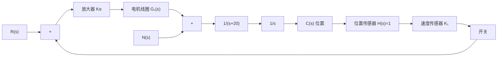

# 例 3-20 磁盘驱动读取系统(续)

为了使例 3-19 磁头控制系统的性能满足表 3-7 所示的设计指标要求, 我们在系统中增加了速度传感器, 其结构如图 3-51 所示。图中

$$G _ {1} (s) = \frac {5 0 0 0}{s + 1 0 0 0}$$

% Ka=80 时系统单位阶跃扰动响应曲线

表 3-7 带速度反馈的磁盘驱动器系统的性能

<table><tr><td>性能指标</td><td>要求值</td><td>实验反馈</td></tr><tr><td>超调量</td><td>&lt;5%</td><td>0%</td></tr><tr><td>调节时间</td><td>&lt;250ms</td><td>261ms</td></tr><tr><td>单位扰动最大响应</td><td>&lt;5×10-3</td><td>-2×10-3</td></tr></table>

试选择放大器增益 $K_{a}$ 和速度传感器传递系数 $K_{1}$ 的数值。

flowchart

图 3-51 带速度反馈的磁盘驱动器读取系统

解 令速度传感器开关开启,且令

$$G _ {2} (s) = \frac {1}{s (s + 2 0)}$$

则闭环传递函数

$$\frac {C (s)}{R (s)} = \frac {K _ {a} G _ {1} (s) G _ {2} (s)}{1 + K _ {a} G _ {1} (s) G _ {2} (s)} = \frac {5 0 0 0 K _ {a}}{s (s + 2 0) (s + 1 0 0 0) + 5 0 0 0 K _ {a}}$$

于是闭环特征方程为

$$s ^ {3} + 1 0 2 0 s ^ {2} + 2 0 0 0 0 s + 5 0 0 0 K _ {a} = 0$$

为了确定在开关开启时使闭环系统稳定的 $K_{a}$ 取值范围, 做如下劳斯表:

$$
\begin{array}{c c c} s ^ {3} & 1 & 2 0 0 0 0 \\ s ^ {2} & 1 0 2 0 & 5 0 0 0 K _ {a} \\ s ^ {1} & b _ {1} \\ s ^ {0} & 5 0 0 0 K _ {a} \end{array}
$$

其中

$$b _ {1} = \frac {1 0 2 0 \times 2 0 0 0 0 - 5 0 0 0 K _ {a}}{1 0 2 0}$$

当 $K_{a} = 4080$ 时， $b_{1} = 0$ ，出现临界稳定情况。由劳斯表可得辅助方程

$$1 0 2 0 s ^ {2} + 5 0 0 0 \times 4 0 8 0 = 0$$

解其方程得系统的一对纯虚根为 $s_{1,2} = \pm 141.4\mathrm{j}$ 。显然，此时使系统稳定的 $K_{a}$ 值范围应取

$$0 < K _ {a} < 4 0 8 0$$

当速度传感器开关闭合时，系统中加入了速度反馈。此时闭环传递函数

$$
\begin{array}{l} \frac {C (s)}{R (s)} = \frac {K _ {a} G _ {1} (s) G _ {2} (s)}{1 + \left[ K _ {a} G _ {1} (s) G _ {2} (s) \right] (1 + K _ {1} s)} \\ = \frac {5 0 0 0 K _ {a}}{s (s + 2 0) (s + 1 0 0 0) + 5 0 0 0 K _ {a} (1 + K _ {1} s)} \\ \end{array}
$$

于是得闭环特征方程为

$$s ^ {3} + 1 0 2 0 s ^ {2} + (2 0 0 0 0 + 5 0 0 0 K _ {a} K _ {1}) s + 5 0 0 0 K _ {a} = 0$$

对应的劳斯表为

$$
\begin{array}{c c c} s ^ {3} & 1 & 2 0 0 0 0 + 5 0 0 0 K _ {a} K _ {1} \\ s ^ {2} & 1 0 2 0 & 5 0 0 0 K _ {a} \\ s ^ {1} & b _ {1} \\ s ^ {0} & 5 0 0 0 K _ {a} \end{array}
$$

其中 $b_{1}=\frac{1020(20000+5000K_{a}K_{1})-5000K_{a}}{1020}$

为保证系统的稳定性，在 $K_{a} > 0$ 的条件下，参数对 $(K_{a}, K_{1})$ 的取值应使 $b_{1} > 0$ 。当取 $K_{1} = 0.05, K_{a} = 100$ 时，利用MATLAB文件求得的系统响应如图3-52所示。

line

