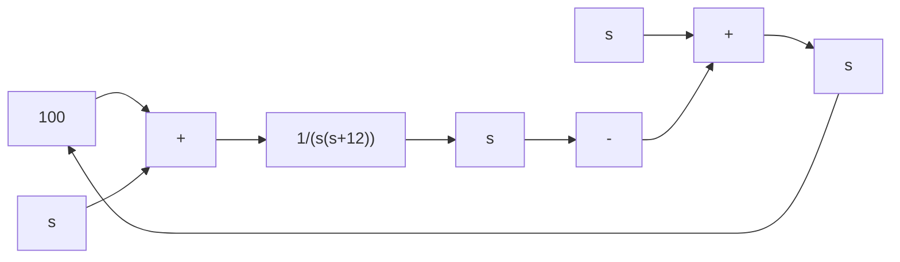

flowchart

(a) 所设计的系统

line

| Time/sec | Amplitude |
| --- | --- |
| 0.0 | 0.0 |
| 0.2 | 0.8 |
| 0.4 | 1.1 |
| 0.6 | 1.0 |
| 0.8 | 1.0 |
| 1.0 | 1.0 |
| 1.2 | 1.0 |
| 1.4 | 1.0 |
| 1.6 | 1.0 |
| 1.8 | 1.0 |
| 2.0 | 1.0 |

(b) 系统对单位阶跃输入(实线)和单位阶跃扰动(虚线)的时间响应  
图 3-55 哈勃太空望远镜指向系统设计结果 (MATLAB)

MATLAB 文本：

$$\mathrm{Ka} = 1 0 0; \mathrm{K} 1 = 1 2;\mathrm{G} 1 = \mathrm{zpk} ([ ], [ 0 - \mathrm{K} 1 ], 1);\mathrm{sys} = \text { feedback } (\mathrm{Ka} * \mathrm{G1}, 1); \quad \% \text { 输入端闭环传递函数描述 }\mathrm{sysn} = \text { feedback } (\mathrm{G1}, \mathrm{Ka}); \quad \% \text { 扰动端闭环传递函数描述 }t = 0; 0. 0 1; 2;\text {step} (\text {sys}, t); \text {hold on}; \quad \% \text {单位阶跃输入响应曲线}\text {step} (\text {sysn}, t); \text {grid} \quad \% \text {单位阶跃扰动响应曲线}$$
