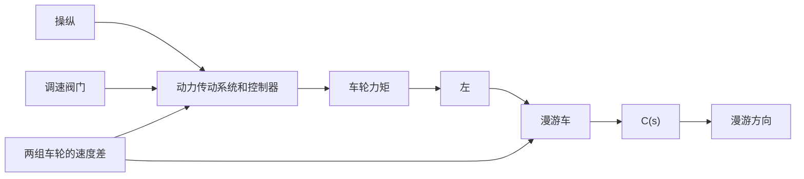

# 例 3-22 火星漫游车转向控制

1997年7月4日，以太阳能作动力的“逗留者号”漫游车在火星上着陆，其外形如图3-56(a)所示。漫游车全重 $10.4\mathrm{kg}$ ，可由地球上发出的路径控制信号 $r(t)$ 实施遥控。漫游车的两组车轮以不同的速度运行，以便实现整个装置的转向。为了进一步探测火星上是否有水，2004年美国国家宇航局又发射了“勇气号”火星探测器。为了便于对比，图3-56(b)给出了“勇气号”外形图。由图可见，“勇气号”与“逗留者号”有许多相似之处，但“勇气号”上的装备与技术更为先进。本例仅研究“逗留者号”漫游车的转向控制[图3-57(a)]，其结构图如图3-57(b)所示。

natural_image

Exterior view of a military vehicle with large wheels and a camouflaged roof (no visible text or symbols)

(a) 逗留者号

natural_image

Black-and-white photo of a Mars rover on the ground with visible exhaust plume and launch tower (no text or symbols)

(b) 勇气号  
图 3-56 火星漫游车外形图

设计目标是选择参数 $K_{1}$ 与 a，确保系统稳定，并使系统对斜坡输入的稳态误差小于或等于输入指令幅度的 24%。

解 由图 3-57(b) 可知, 闭环特征方程为

$$1 + G _ {c} (s) G _ {0} (s) = 0$$

即 $1 + \frac{K_1(s + a)}{s(s + 1)(s + 2)(s + 5)} = 0$

于是有 $s^4 + 8s^3 + 17s^2 + (10 + K_1)s + aK_1 = 0$

为了确定 $K_{1}$ 和 $\pmb{a}$ 的稳定区域，建立如下劳斯表：

$$
\begin{array}{c c c c} s ^ {4} & 1 & 1 7 & a K _ {1} \\ s ^ {3} & 8 & 1 0 + K _ {1} \\ s ^ {2} & \frac {1 2 6 - K _ {1}}{8} & a K _ {1} \\ s ^ {1} & \frac {1 2 6 0 + (1 1 6 - 6 4 a) K _ {1} - K _ {1} ^ {2}}{1 2 6 - K _ {1}} \\ s ^ {0} & a K _ {1} \end{array}
$$

由劳斯稳定判据知，使火星漫游车闭环稳定的充分必要条件为

$$K _ {1} < 1 2 6a K _ {1} > 01 2 6 0 + (1 1 6 - 6 4 a) K _ {1} - K _ {1} ^ {2} > 0$$

flowchart

(a) 双轮组漫游车的转向控制系统

flowchart

(b) 结构图  
图 3-57 火星漫游车转向控制系统

当 $K_{1}>0$ 时，漫游车系统的稳定区域如图 3-58 所示。

由于设计指标要求系统在斜坡输入时的稳态误差不大于输入指令幅度的 24%，故需要对 $K_{1}$ 与 a 的取值关系加以约束。令 $r(t)=At$ ，其中 A 为指令斜率，系统的稳态误差为

$$e _ {s} (\infty) = \frac {A}{K _ {v}}$$

式中，静态速度误差系数
