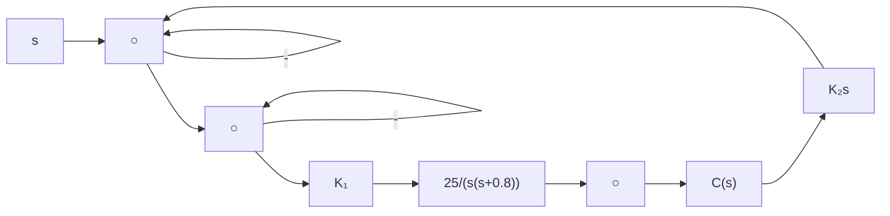
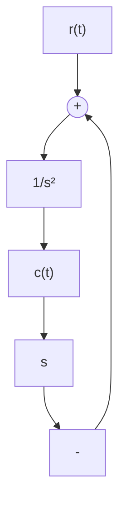

# 习题

3-1 设某高阶系统可用下列一阶微分方程近似描述：

$$T \dot {c} (t) + c (t) = \tau \dot {r} (t) + r (t)$$

式中， $1 > T - \tau > 0$ 。试证明系统的动态性能指标为

$$t _ {r} = 2. 2 Tt _ {s} = \left(3 + \ln \frac {T - \tau}{T}\right) T (\Delta = 5 \%)$$

3-2 设各系统的微分方程式如下：

(1) $0.2\dot{c}(t)=2r(t)$ ;   
(2) $0.04\ddot{c}(t) + 0.24\dot{c}(t) + c(t) = r(t)$ 。

试求系统的单位脉冲响应 $c(t)$ 和单位阶跃响应 $c(t)$ 。已知全部初始条件为零。

3-3 已知各系统的脉冲响应,试求系统的闭环传递函数 $\Phi(s)$ 。

(1) $c(t) = 0.0125\mathrm{e}^{-1.25t}$ ;   
(2) $c(t) = 5t + 10\sin (4t + 45^{\circ})$   
(3) $c(t) = 0.1(1 - \mathrm{e}^{-t / 3})$

3-4 已知二阶系统的单位阶跃响应为

$$c (t) = 1 0 - 1 2. 5 \mathrm{e} ^ {- 1. 2 t} \sin (1. 6 t + 5 3. 1 ^ {\circ})$$

试求系统的超调量 $\sigma \%$ 、峰值时间 $t_p$ 和调节时间 $t_s$ 。

3-5 设单位反馈系统的开环传递函数为

$$G (s) = \frac {0 . 4 s + 1}{s (s + 0 . 6)}$$

试求系统在单位阶跃输入下的动态性能。

3-6 已知控制系统的单位阶跃响应为

$$c (t) = 1 + 0. 2 \mathrm{e} ^ {- 6 0 t} - 1. 2 \mathrm{e} ^ {- 1 0 t}$$

试确定系统的阻尼比 $\zeta$ 和自然频率 $\omega_{n}$ 。

3-7 设图 3-59 是简化的飞行控制系统结构图, 试选择参数 $K_{1}$ 和 $K_{t}$ , 使系统的 $\omega_{n}=6, \zeta=1$ 。

flowchart

图 3-59 飞行控制系统

3-8 试分别求出图 3-60(a)～(c) 各系统的自然频率和阻尼比，并列表比较其动态性能。

```mermaid
graph LR
    A["r(t)"] --> B((+))
    B --> C["1/(s²)"]
    C --> D["c(t)"]
    D --> E
    E --> F
    F --> G
    G --> H
    H --> I
    I --> J
    J --> K
    K --> L
    L --> M
    M --> N
    N --> O
    O --> P
    P --> Q
    Q --> R
    R --> S
    S --> T
    T --> U
    U --> V
    V --> W
    W --> X
    X --> Y
    Y --> Z
    Z --> A
```

flowchart

(a)

flowchart

(b)

flowchart

(c)   
图 3-60 控制系统

3-9 设控制系统如图 3-61 所示。要求：

flowchart

