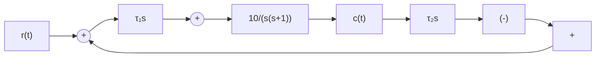
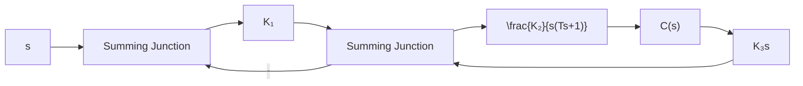
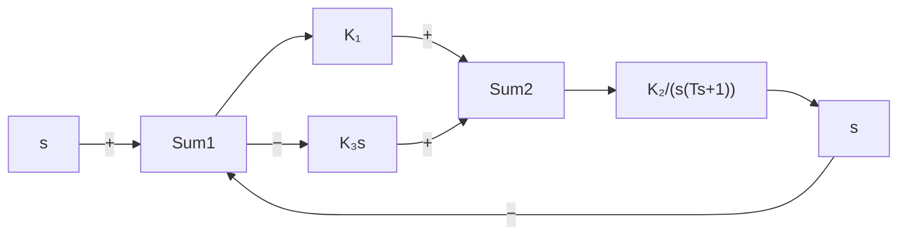

图 3-61 控制系统

(1) 取 $\tau_{1}=0, \tau_{2}=0.1$ ，计算测速反馈校正系统的超调量、调节时间和速度误差；  
(2) 取 $\tau_{1}=0.1, \tau_{2}=0$ ，计算比例-微分校正系统的超调量、调节时间和速度误差。

3-10 图 3-62 所示控制系统有(a)和(b)两种不同的结构方案,其中 T>0 不可变。要求:

flowchart

(a)

flowchart

(b)   
图 3-62 控制系统

(1) 在这两种方案中, 应如何调整 $K_{1}, K_{2}$ 和 $K_{3}$ , 才能使系统获得较好的动态性能?  
(2) 比较说明两种结构方案的特点。

3-11 已知系统特征方程为

$$3 s ^ {4} + 1 0 s ^ {3} + 5 s ^ {2} + s + 2 = 0$$

试用劳斯稳定判据和赫尔维茨稳定判据确定系统的稳定性。

3-12 试求系统在 s 右半平面的根数及虚根值, 已知系统特征方程如下:

(1) $s^{5}+3s^{4}+12s^{3}+24s^{2}+32s+48=0;$   
(2) $s^{6}+4s^{5}-4s^{4}+4s^{3}-7s^{2}-8s+10=0;$   
(3) $s^5 + 3s^4 + 12s^3 + 20s^2 + 35s + 25 = 0$ 。

3-13 已知单位反馈系统的开环传递函数为

$$G (s) = \frac {K (0 . 5 s + 1)}{s (s + 1) (0 . 5 s ^ {2} + s + 1)}$$

试确定系统稳定时的 K 值范围。

3-14 已知系统结构图如图 3-63 所示。试用劳斯稳定判据确定能使系统稳定的反馈参数 $\tau$ 的取值范围。

flowchart

图 3-63 控制系统

3-15 已知单位反馈系统的开环传递函数分别为

(1) $G(s) = \frac{100}{(0.1s + 1)(s + 5)};$   
(2) $G(s) = \frac{50}{s(0.1s + 1)(s + 5)};$   
(3) $G(s) = \frac{10(2s + 1)}{s^2(s^2 + 6s + 100)}$ 。

试求输入分别为 $r(t)=2t$ 和 $r(t)=2+2t+t^{2}$ 时，系统的稳态误差。

3-16 已知单位反馈系统的开环传递函数分别为

(1) $G(s) = \frac{50}{(0.1s + 1)(2s + 1)}$ ;   
(2) $G(s) = \frac{K}{s(s^2 + 4s + 200)}$ ;   
(3) $G(s) = \frac{10(2s + 1)(4s + 1)}{s^2(s^2 + 2s + 10)}$

试求位置误差系数 $K_{p}$ ，速度误差系数 $K_{v}$ ，加速度误差系数 $K_{a}$ 。

3-17 设单位反馈系统的开环传递函数 $G(s) = 1/Ts$ 。试用动态误差系统法求出当输入信号分别为 $r(t) = t^{2}/2$ 和 $r(t) = \sin 2t$ 时，系统的稳态误差。

3-18 设控制系统如图 3-64 所示。其中
