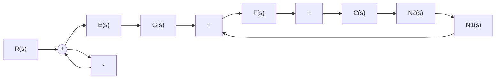
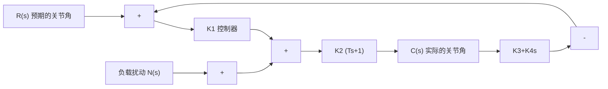

$$G (s) = K _ {p} + \frac {K}{s}, \quad F (s) = \frac {1}{J s}$$

输入 $r(t)$ 以及扰动 $n_1(t)$ 和 $n_2(t)$ 均为单位阶跃函数。试求：

(1) 在 $r(t)$ 作用下系统的稳态误差；  
(2) 在 $n_{1}(t)$ 作用下系统的稳态误差；  
(3) 在 $n_{1}(t)$ 和 $n_{2}(t)$ 同时作用下系统的稳态误差。

flowchart

图 3-64 控制系统

3-19 设闭环传递函数的一般形式为

$$\Phi (s) = \frac {G (s)}{1 + G (s) H (s)} = \frac {b _ {m} s ^ {m} + b _ {m - 1} s ^ {m - 1} + \cdots + b _ {1} s + b _ {0}}{s ^ {n} + a _ {n - 1} s ^ {n - 1} + \cdots + a _ {1} s + a _ {0}}$$

误差定义取 $e(t) = r(t) - c(t)$ 。试证：

(1) 系统在阶跃信号输入下, 稳态误差为零的充分条件是: $b_{0}=a_{0}, b_{i}=0 (i=1,2,\cdots,m)$ ;   
(2) 系统在斜坡信号输入下, 稳态误差为零的充分条件是: $b_{0} = a_{0}, b_{1} = a_{1}, b_{i} = 0 (i = 2, 3, \cdots, m)$ 。

3-20 设随动系统的微分方程为

$$T _ {1} \frac {\mathrm{d} ^ {2} c (t)}{\mathrm{d} t ^ {2}} + \frac {\mathrm{d} c (t)}{\mathrm{d} t} = K _ {2} u (t)u (t) = K _ {1} [ r (t) - b (t) ]T _ {2} \frac {\mathrm{d} b (t)}{\mathrm{d} t} + b (t) = c (t)$$

式中， $T_{1}, T_{2}$ 和 $K_{2}$ 为正常数。若要求 $r(t)=1+t$ 时， $c(t)$ 对 $r(t)$ 的稳态误差不大于正常数 $\varepsilon_{0}$ ，试问 $K_{1}$ 应满足什么条件？已知全部初始条件为零。

3-21 机器人应用反馈原理控制每个关节的方向。由于负载的改变以及机械臂伸展位置的变化,负载对机器人会产生不同的影响。例如,机械爪抓持负载后,就可能使机器人产生偏差。已知机器人关节指向控制系统如图 3-65 所示,其中负载扰动力矩为 $1 / s$ 。要求:

flowchart

图 3-65 机器人关节指向控制系统

(1) 当 $R(s)=0$ 时，确定 $N(s)$ 对 $C(s)$ 的影响，指出减少此种影响的方法；  
(2) 当 $N(s) = 0, R(s) = \frac{1}{s}$ 时，计算系统在输出端定义的稳态误差，指出减少此种稳态误差的方法。

3-22 在造纸厂的卷纸过程中，卷开轴和卷进轴之间的纸张张力采用图 3-66 所示的卷纸张力控制系统进行控制，以保持张力 F 基本恒定。随着纸卷厚度的变化，纸上的张力 F 会发生变化，因此必须调整电机的转速 $\omega_{0}(t)$ 。如果不对卷进电机的转速 $\omega_{0}(t)$ 进行控制，则当纸张不断地从卷开轴向卷进轴运动时，线速度 $v_{0}(t)$ 就会下降，从而纸张承受的张力 F 会相应地减小。

flowchart

