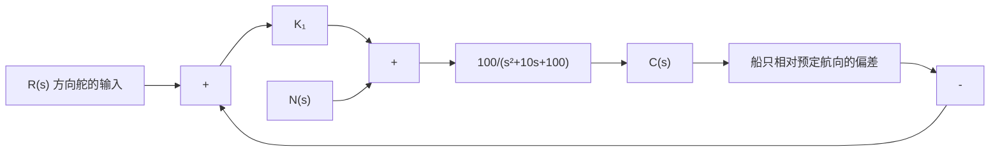

```mermaid
graph LR
    A["卷开轴"] -->|v₁(t)| B["线性偏差转换器"]
    B --> C["放大器"]
    C --> D["整流器"]
    D --> E["电机"]
    F["卷进轴"] -->|v₀(t)| G["电机"]
    H["Rα"] --> I["Lα"]
    I --> J["e₀"]
    J --> C
    style A fill:#f9f,stroke:#333
    style F fill:#f9f,stroke:#333
    style H fill:#f9f,stroke:#333
    style B fill:#ccf,stroke:#333
    style C fill:#ccf,stroke:#333
    style D fill:#ccf,stroke:#333
    style E fill:#ccf,stroke:#333
    style G fill:#ccf,stroke:#333
```
</details>

图 3-66 卷纸张力控制系统

在张力控制系统中，采用了三个滑轮和一个弹簧组成的张力测量器，用来测量纸上的张力。记弹簧力为 $K_{1}y$ ，其中 $y$ 是弹簧偏离平衡位置的距离，则张力可以表示为 $2F = K_{1}y$ ，其中 $F$ 为张力增量的垂直分量。此外，假设线性偏差转换器、整流器和放大器合在一起后，可以表示为 $e_0 = -K_2y$ ；电机的传递系数为 $K_{m}$ ，时间常数 $T_{m} = L_{a} / R_{a}$ ，卷进轴的线速度是电机角速度的两倍，即 $v_{0}(t) = 2\omega_{0}(t)$ 。这样，电机的运动方程为

$$E _ {0} (s) = \frac {1}{K _ {m}} \left[ T _ {m} s \Omega_ {0} (s) + \Omega_ {0} (s) \right] + K _ {3} \Delta F (s)$$

式中， $K_{3}$ 为张力扰动系数； $\Delta F$ 为张力扰动增量。要求在所给的条件下完成：

(1) 绘出张力控制系统结构图, 其中应包含张力扰动 $\Delta F(s)$ 和卷开轴速度扰动 $\Delta V_{1}(s)$ ;  
(2) 当输入为单位阶跃扰动 $\Delta V_{1}(s)=\frac{1}{s}$ 时，确定张力的稳态误差。

3-23 现代船舶航向控制系统如图 3-67 所示。 $N(s)$ 表示持续不断的风力扰动，已知 $N(s)=\frac{1}{s}$ ，图中增益 $K_{1}=5$ 或 $K_{1}=30$ 。要求在下面所给的条件下，确定风力对船舶航向的稳态影响：


<details>
<summary>flowchart</summary>


</details>

图 3-67 船舶航向控制系统

(1) 假定方向舵的输入 $R(s)=0$ ，系统没有任何其他扰动，或其他调整措施；  
(2) 证明操纵方向舵能使航向偏离重新归零。

3-24 设机器人常用的手爪如图 3-68(a) 所示, 它由直流电机驱动, 以改变两个手爪间的夹角 $\theta$ 。手爪控制系统模型如图 3-68(b) 所示, 相应的结构图如图 3-68(c) 所示。图中 $K_{m} = 30$ , $R_{f} = 1\Omega$ , $K_{f} = K_{i} = 1$ , $J = 0.1$ , $f = 1$ 。要求:

(1) 当功率放大器增益 $K_{a}=20$ ，输入 $\theta_{d}(t)$ 为单位阶跃信号时，确定系统的单位阶跃响应 $\theta(t)$ ;  
(2) 当 $\theta_{d}(t)=0, n(t)=1(t)$ 时，确定负载对系统的影响；

(3) 当 $n(t)=0,\theta_{d}(t)=t,t>0$ 时，确定系统的稳态误差 $e_{s}(\infty)$ 。


<details>
<summary>flowchart</summary>

```mermaid
graph LR
    A["手爪"] --> B["控制旋钮"]
    B --> C["电位计"]
    C --> D["偏差放大器"]
    D --> E["功率放大器"]
    E --> F["直流电机"]
    F --> G["电位计"]
    G --> H["反馈信号"]
    H --> I["θ_d"]
    I --> J["θ"]
    J --> K["θ_0"]
    K --> L["θ"]
