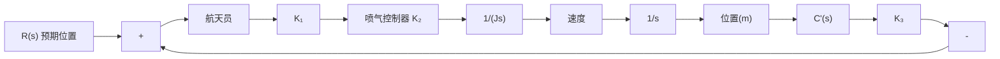
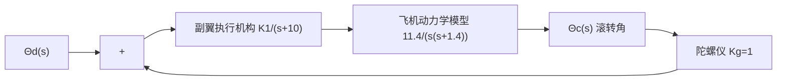

M["手爪控制系统模型"] --> N["功率放大器"]
    N --> O["K_a"]
    O --> P["K_m/R_f"]
    P --> Q["+"]
    Q --> R["1/(s(Js+f'))"]
    R --> S["Θ(s)"]
    S --> T["K_f"]
    T --> U["-"]
    U --> V["Theta(s)"]

W["Theta(s)"] --> X["K_i"]
    X --> Y["+"]
    Y --> Z["功 率 放 大 器"]
    Z --> AA["K_a"]
    AA --> AB["K_m/R_f"]
    AB --> AC["+"]
    AC --> AD["N(s)"]
    AD --> AE["-"]
    AE --> AF["1/(s(Js+f'))"]
    AF --> AG["Θ(s)"]
```
</details>

图 3-68 机器人手爪控制系统

3-25 1984年2月7日，美国宇航员利用手持喷气推进装置，完成了人类历史上的首次太空行走，如图3-69(a)所示。宇航员机动控制系统结构图如图3-69(b)所示，其中喷气控制器可用增益 $K_{2}$ 表示， $K_{3}$ 为速度反馈增益。若将宇航员以及他手臂上的装置一并考虑，系统总的转动惯量 $J = 25\mathrm{N}\cdot \mathrm{m}\cdot \mathrm{s}^2 /\mathrm{rad}$ 。要求：

(1) 当输入为单位斜坡 $r(t)=t\ m\cdot s^{-1}$ 时，确定速度反馈增益 $K_{3}$ 的取值，使系统稳态误差 $e_{s}(\infty)\leqslant0.01m;$   
(2) 采用(1)中求得的 $K_{3}$ , 确定 $K_{1}K_{2}$ 的取值, 使系统超调量 $\sigma \% \leqslant 10\%$ 。

3-26 在喷气式战斗机的自动驾驶仪中,配置有横滚角控制系统,其结构图如图 3-70 所示。要求:

(1) 确定闭环传递函数 $\Theta_{c}(s)/\Theta_{d}(s)$ ;  
(2) 当 $K_{1}$ 分别等于 0.7, 3.0 和 6.0 时, 确定闭环系统的特征根;  
(3) 在(2)所给的条件下,应用主导极点概念,确定各二阶近似系统,估计原有系统的超调量和峰值时间;  
(4) 绘出原有系统的实际单位阶跃响应曲线，并与(3)中的近似结果进行比较。

3-27 打磨机器人能够按照预先设定的路径(输入指令)对加工后的工件进行打磨抛光。在实践中，机器人自身的偏差、机械加工误差以及工具的磨损等，都会导致打磨加工误差。若利用力反馈修正机器人的运动路径,可以消除这些误差,提高抛光精度,但是,又可能使接触稳定性问题变得难以解决。例如,在引入腕力传感器构成力反馈的同时,就带来了新的稳定性问题。


<details>
<summary>natural_image</summary>

Astronaut performing a spacewalk with a helmet and wings, no visible text or symbols
</details>

(a) 太空行走


<details>
<summary>flowchart</summary>


</details>

(b) 机动控制系统

图 3-69 宇航员机动控制系统  


<details>
<summary>flowchart</summary>


</details>

图 3-70 横滚角控制系统

打磨机器人的结构图如图 3-71 所示。若可调增益 $K_{1}$ 及 $K_{2}$ 均大于零，试确定能保证系统稳定性的 $K_{1}$ 和 $K_{2}$ 的取值范围。
