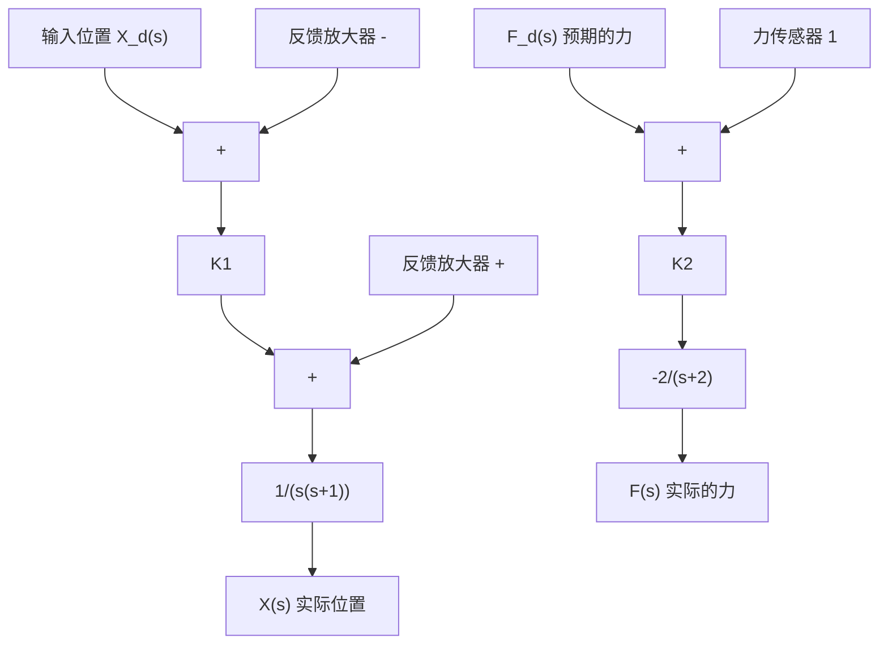
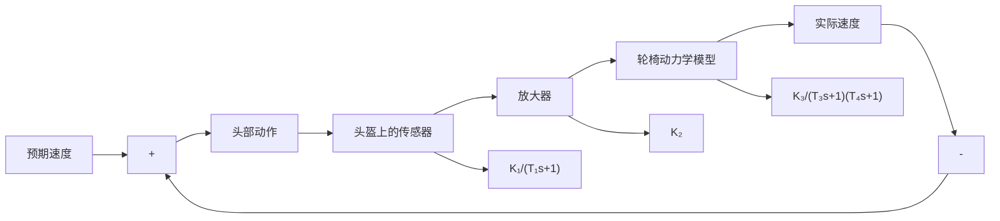
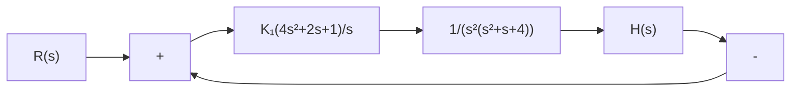

3-28 一种新型电动轮椅装有一种非常实用的速度控制系统，能使颈部以下有残障的人士自行驾驶这种电动轮椅。该系统在头盔上以 $90^{\circ}$ 间隔安装了四个速度传感器，用来指示前、后、左、右四个方向。头盔传感系统的综合输出与头部运动的幅度成正比。图3-72给出了该控制系统的结构图，其中时间常数 $T_{1} = 0.5\mathrm{s}, T_{3} = 1\mathrm{s}, T_{4} = 0.25\mathrm{s}$ 。要求：

(1) 确定使系统稳定的 K 的取值 $(K=K_{1}K_{2}K_{3})$ ;  
(2) 确定增益 K 的取值, 使系统单位阶跃响应的调节时间等于 $4s(\Delta=2\%)$ , 并计算此时系统的特征根。

flowchart

图 3-71 打磨机器人

flowchart

图 3-72 轮椅控制系统

3-29 设垂直起飞飞机如图 3-73(a) 所示, 起飞时飞机的四个发动机将同时工作。垂直起飞飞机的高度控制系统结构图如图 3-73(b) 所示。要求:

(1) 当 $K_{1}=1$ 时, 判断系统是否稳定;  
(2) 确定使系统稳定的 $K_{1}$ 的取值范围。

3-30 火星自主漫游车的导向控制系统结构图如图 3-74 所示。该系统在漫游车的前后部都装有一个导向轮，其反馈通道传递函数为

$$H (s) = 1 + K _ {t} s$$

要求：

(1) 确定使系统稳定的 $K_{t}$ 值范围；  
(2) 当 $s_{3} = -5$ 为该系统的一个闭环特征根时，试计算 $K_{t}$ 的取值，并计算另外两个闭环特征根；  
(3) 应用(2)求出的 $K_{t}$ 值, 确定系统的单位阶跃响应。

3-31 一种采用电磁力驱动的磁悬浮列车的构造如图 3-75(a) 所示, 其运行速度可达 480km/h, 载客量为 400 人。但是, 磁悬浮列车的正常运行需要在车体与轨道之间保持 0.635cm 的气隙。设间隙控制系统结构图如图 3-75(b) 所示。若控制器取为

$$G _ {c} (s) = \frac {K _ {a} (s + 2)}{s + 1 2}$$

式中， $K_{a}$ 为控制器增益。要求：

(1) 确定使系统稳定的 $K_{a}$ 值范围；

natural_image

Black-and-white photo of a futuristic aircraft with visible propellers and fuselage, no text or symbols present.

(a) 垂直起飞飞机

flowchart

(b) 控制系统结构图
