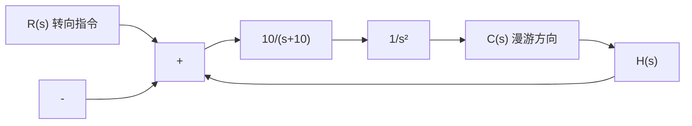
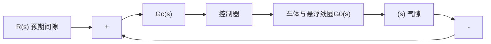

图 3-73 垂直起飞高度控制系统  

flowchart

图 3-74 火星漫游车导向控制系统  

text_image

车体
电磁铁
导向
磁铁
吸引区域
气隙
T形
导轨

(a) 磁悬浮列车

flowchart

(b) 间隙控制系统  
图 3-75 磁悬浮列车控制系统

(2) 可否确定 $K_{a}$ 的合适取值, 使系统对单位阶跃输入的稳态跟踪误差为零;  
(3) 取控制器增益 $K_{a}=2$ ，确定系统的单位阶跃响应。
