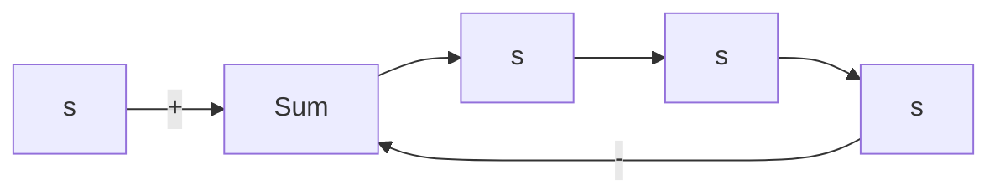

# 3. 闭环零、极点与开环零、极点之间的关系

由于开环零、极点是已知的，建立开环零、极点与闭环零、极点之间的关系，有助于闭环系统根轨迹的绘制，并由此导出根轨迹方程。 $R(s)$

设控制系统如图 4-3 所示, 其闭环传递函数为

$$\Phi (s) = \frac {G (s)}{1 + G (s) H (s)} \tag {4-1}$$

在一般情况下,前向通路传递函数 $G(s)$ 和反馈通路传递函数 $H(s)$ 可分别表示为

flowchart

图 4-3 控制系统

$$G (s) = \frac {K _ {G} (\tau_ {1} s + 1) (\tau_ {2} ^ {2} s ^ {2} + 2 \zeta_ {1} \tau_ {2} s + 1) \cdots}{s ^ {\nu} (T _ {1} s + 1) (T _ {2} ^ {2} s ^ {2} + 2 \zeta_ {2} T _ {2} s + 1) \cdots} = K _ {G} ^ {*} \frac {\prod_ {i = 1} ^ {f} (s - z _ {i})}{\prod_ {i = 1} ^ {q} (s - p _ {i})} \tag {4-2}$$

式中， $K_{G}$ 为前向通路增益； $K_{G}^{*}$ 为前向通路根轨迹增益，它们之间满足如下关系：

$$K _ {G} ^ {*} = K _ {G} \frac {\tau_ {1} \tau_ {2} {} ^ {2} \cdots}{T _ {1} T _ {2} {} ^ {2} \cdots} \tag {4-3}$$

以及

$$H (s) = K _ {H} ^ {*} \frac {\prod_ {j = 1} ^ {l} \left(s - z _ {j}\right)}{\prod_ {j = 1} ^ {h} \left(s - p _ {j}\right)} \tag {4-4}$$

式中， $K_{H}^{*}$ 为反馈通路根轨迹增益。于是，图4-3系统的开环传递函数可表示为

$$G (s) H (s) = K ^ {*} \frac {\prod_ {i = 1} ^ {f} \left(s - z _ {i}\right) \prod_ {j = 1} ^ {l} \left(s - z _ {j}\right)}{\prod_ {i = 1} ^ {q} \left(s - p _ {i}\right) \prod_ {j = 1} ^ {h} \left(s - p _ {j}\right)} \tag {4-5}$$

式中， $K^{*}=K_{G}^{*}K_{H}^{*}$ ，称为开环系统根轨迹增益，它与开环增益K之间的关系类似于式(4-3)，仅相差一个比例常数。对于有m个开环零点和n个开环极点的系统，必有 $f+l=m$ 和 $q+h=n$ 。将式(4-2)和式(4-5)代入式(4-1)，得

$$\Phi (s) = \frac {K _ {G} ^ {*} \prod_ {i = 1} ^ {f} \left(s - z _ {i}\right) \prod_ {j = 1} ^ {h} \left(s - p _ {j}\right)}{\prod_ {i = 1} ^ {n} \left(s - p _ {i}\right) + K ^ {*} \prod_ {j = 1} ^ {m} \left(s - z _ {j}\right)} \tag {4-6}$$

比较式(4-5)和式(4-6)，可得以下结论：

1) 闭环系统根轨迹增益,等于开环系统前向通路根轨迹增益。对于单位反馈系统,闭环系统根轨迹增益就等于开环系统根轨迹增益。  
2) 闭环零点由开环前向通路传递函数的零点和反馈通路传递函数的极点所组成。对于单位反馈系统，闭环零点就是开环零点。  
3）闭环极点与开环零点、开环极点以及根轨迹增益 $K^{*}$ 均有关。

根轨迹法的基本任务在于：由已知的开环零、极点的分布及根轨迹增益，通过图解的方法找出闭环极点。一旦确定闭环极点后，闭环传递函数的形式便不难确定，因为闭环零点可由式(4-6)直接得到。在已知闭环传递函数的情况下，闭环系统的时间响应可利用拉氏反变换的方法求出。
