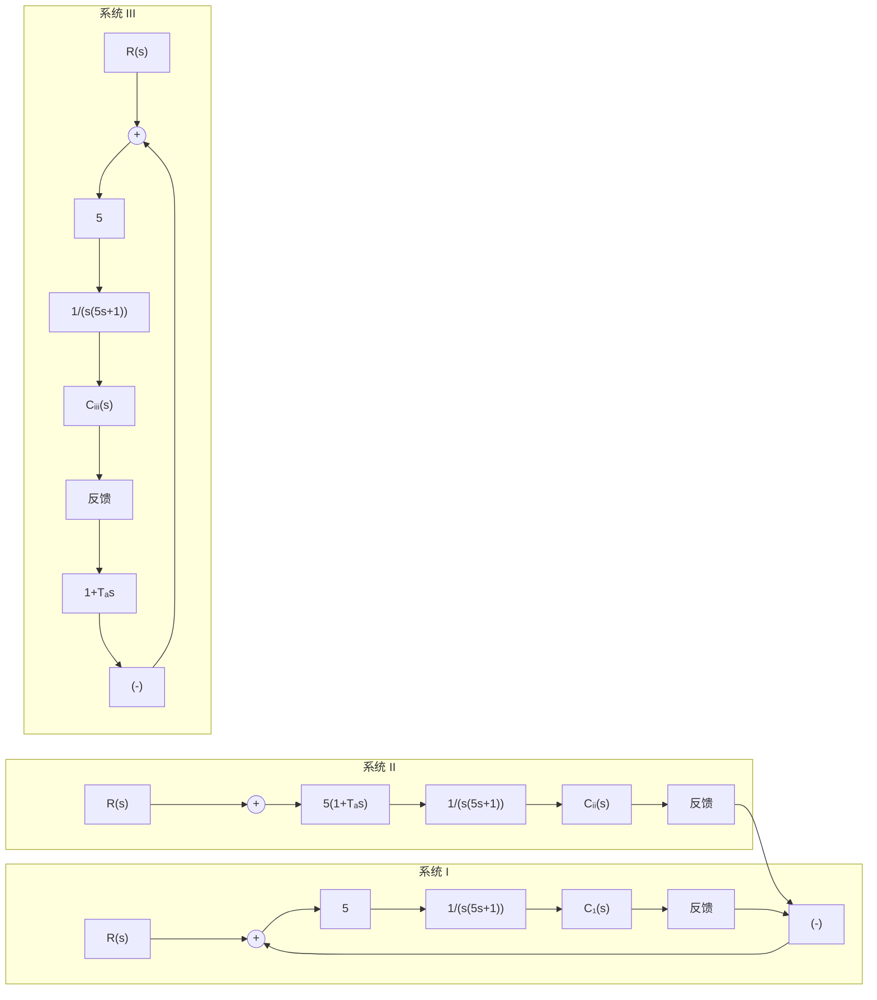

# 1. 参数根轨迹

以非开环增益为可变参数绘制的根轨迹称为参数根轨迹，以区别于以开环增益 $K$ 为可变参数的常规根轨迹。

绘制参数根轨迹的法则与绘制常规根轨迹的法则完全相同。只要在绘制参数根轨迹之前，引入等效单位反馈系统和等效传递函数概念，则常规根轨迹的所有绘制法则，均适用于参数根轨迹的绘制。为此，需要对闭环特征方程

$$1 + G (s) H (s) = 0 \tag {4-26}$$

进行等效变换，将其写为如下形式：

$$A \frac {P (s)}{Q (s)} = - 1 \tag {4-27}$$

其中， $A$ 为除 $K^{*}$ 外，系统任意的变化参数，而 $P(s)$ 和 $Q(s)$ 为两个与 $A$ 无关的首一多项式。显然，式(4-27)应与式(4-26)相等，即

$$Q (s) + A P (s) = 1 + G (s) H (s) = 0 \tag {4-28}$$

根据式(4-28)，可得等效单位反馈系统，其等效开环传递函数为

$$G _ {1} (s) H _ {1} (s) = A \frac {P (s)}{Q (s)} \tag {4-29}$$

利用式(4-29)画出的根轨迹, 就是参数 $A$ 变化时的参数根轨迹。需要强调指出, 等效开环传递函数是根据式(4-28)得来的, 因此“等效”的含义仅在闭环极点相同这一点上成立, 而闭环零点一般是不同的。由于闭环零点对系统动态性能有影响, 所以由闭环零、极点分布来分析和估算系统性能时, 可以采用参数根轨迹上的闭环极点, 但必须采用原来闭环系统的零点。这一处理方法和结论, 对于绘制开环零极点变化时的根轨迹, 同样适用。

例 4-5 设位置随动系统如图 4-13 所示。图中，系统Ⅰ为比例控制系统，系统Ⅱ为比例-微分控制系统，系统Ⅲ为测速反馈控制系统， $T_{a}$ 表示微分器时间常数或测速反馈系数。试分析 $T_{a}$ 对系统性能的影响，并比较系统Ⅱ和Ⅲ在具有相同阻尼比 $\zeta=0.5$ 时的有关特点。

解 显然,系统Ⅱ和Ⅲ具有相同的开环传递函数,即

$$G (s) H (s) = \frac {5 (1 + T _ {a} s)}{s (1 + 5 s)}$$

但它们的闭环传递函数是不相同的，即

$$\Phi_ {\mathrm{II}} (s) = \frac {5 (1 + T _ {a} s)}{s (1 + 5 s) + 5 (1 + T _ {a} s)} \tag {4-30}\Phi_ {\text { Ⅲ }} (s) = \frac {5}{s (1 + 5 s) + 5 (1 + T _ {a} s)} \tag {4-31}$$

从式(4-30)和式(4-31)可以看出，两者具有相同的闭环极点（在 $T_{a}$ 相同时），但是系统Ⅱ具有闭环零点 $(-1 / T_{a})$ ，而系统Ⅲ不具有闭环零点。

现在将系统Ⅱ或Ⅲ的闭环特征方程式写成

$$1 + T _ {a} \frac {s}{s (s + 0 . 2) + 1} = 0 \tag {4-32}$$

如果令

$$G _ {1} (s) H _ {1} (s) = T _ {a} \frac {s}{s (s + 0 . 2) + 1}$$

则式(4-32)代表一个根轨迹方程,其根轨迹如图 4-14 所示。图中,当 $T_{a}=0$ 时,闭环极点位置为 $s_{1,2}=-0.1\pm j0.995$ ,它即是系统 I 的闭环极点

flowchart

图 4-13 位置随动系统

line

| Point Label | X | Y |
| --- | --- | --- |
| ζ=0.5 | -1 | 1 |
| Ta=0.8 | -1 | 1 |
| Ta=1.3 | -1 | 1 |
| -0.5-j0.87 | -1 | -1 |

图 4-14 系统 II 和 III 在 $T_{a}$ 变化时的根轨迹
