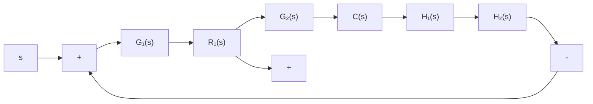

# 3. 零度根轨迹

如果所研究的控制系统为非最小相位系统，则有时不能采用常规根轨迹的绘制法则来绘制系统的根轨迹，因为其相角遵循 $0^{\circ} + 2k\pi$ 条件，而不是 $180^{\circ} + 2k\pi$ 条件，故一般称之为零度根轨迹。这里所谓的非最小相位系统，系指在 $s$ 右半平面具有开环零极点的控制系统，其定义和特性将在下一章详细介绍。此外，如果有必要绘制正反馈系统的根轨迹，那么也必然会产生 $0^{\circ} + 2k\pi$ 的相角条件。一般说来，零度根轨迹的来源有两个方面：其一是非最小相位系统中包含 $s$ 最高次幂的系数为负的因子；其二是控制系统中包含有正反馈内回路。前者是由于被控对象，如飞机、导弹的本身特性所产生的，或者是在系统结构图变换过程中所产生的；后者是由于某种性能指标要求，使得在复杂的控制系统设计中，必须包含正反馈内回路所致。

flowchart

图 4-19 复杂控制系统

零度根轨迹的绘制方法，与常规根轨迹的绘制方法略有不同。以正反馈系统为例，设某个复杂控制系统如图4-19所示，其中内回路采用正反馈，这种系统通常由外回路加以稳定。为了分析整个控制系统的性能，首先要确定内回路的零、极点。用根轨迹法确定内回路的零、极点，就相当于绘制正反馈系统的根轨迹。在图4-19中，正反馈内回路的闭环传

递函数为

$$\frac {C (s)}{R _ {1} (s)} = \frac {G _ {2} (s)}{1 - G _ {2} (s) H _ {2} (s)}$$

于是，得到正反馈系统的根轨迹方程

$$G _ {2} (s) H _ {2} (s) = 1 \tag {4-36}$$

上式可等效为下列两个方程

$$\sum_ {j = 1} ^ {m} \angle (s - z _ {j}) - \sum_ {i = 1} ^ {n} \angle (s - p _ {i}) = 0 ^ {\circ} + 2 k \pi \tag {4-37}k = 0, \pm 1, \pm 2, \dotsK ^ {*} = \frac {\prod_ {i = 1} ^ {n} | s - p _ {i} |}{\prod_ {j = 1} ^ {m} | s - z _ {j} |} \tag {4-38}$$

前者称为零度根轨迹的相角条件,后者叫做零度根轨迹的模值条件。式中各符号的意义与以前指出的相同。

将式(4-37)和式(4-38)与常规根轨迹相应的式(4-9)和式(4-10)相比可知,它们的模值条件完全相同,仅相角条件有所改变。因此,常规根轨迹的绘制法则,原则上可以应用于零度根轨迹的绘制,但在与相角条件有关的一些法则中,需作适当调整。从这种意义上说,零度根轨迹也是常规根轨迹的一种推广。

绘制零度根轨迹时,应调整的绘制法则有:

法则 3 中渐近线的交角应改为

$$\varphi_ {a} = \frac {2 k \pi}{n - m}; \qquad k = 0, 1, \dots , n - m - 1 \tag {4-39}$$

法则4中根轨迹在实轴上的分布应改为：实轴上的某一区域，若其右方开环实数零、极点个数之和为偶数，则该区域必是根轨迹。

法则6中根轨迹的起始角和终止角应改为：起始角为其他零、极点到所求起始角复数极点的诸向量相角之差，即

$$
\theta_ {p _ {i}} = 2 k \pi + \left(\sum_ {j = 1} ^ {m} \varphi_ {z _ {j} p _ {i}} - \sum_ {\substack {j = 1 \\ (j \neq i)}} ^ {n} \theta_ {p _ {j} p _ {i}}\right) \tag{4 - 40}
$$

终止角等于其他零、极点到所求终止角复数零点的诸向量相角之差的负值，即

$$
\varphi_ {z _ {i}} = 2 k \pi - \left(\sum_ {\substack {j = 1 \\ (j \neq i)}} ^ {m} \varphi_ {z _ {j} z _ {i}} - \sum_ {j = 1} ^ {n} \theta_ {p _ {j} z _ {i}}\right) \tag{4 - 41}
$$

除上述三个法则外,其他法则不变。为了便于使用,表 4-3 列出了零度根轨迹图的绘制法则。

表 4-3 零度根轨迹图绘制法则
