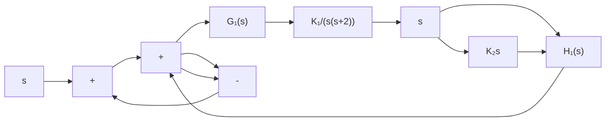

# 例 4-8 自动焊接头控制

自动焊接头需要进行精确定位控制,其控制系统结构图如图 4-26 所示。图中, $K_{1}$ 为放大器增益, $K_{2}$ 为测速反馈系数。

设计要求：用根轨迹法选择参数 $K_{1}$ 与 $K_{2}$ ，使系统满足如下性能指标：

1) 系统对斜坡输入响应的稳态误差≤斜坡幅值的 35%;   
2）系统主导极点的阻尼比 $\zeta \geqslant 0.707$ ;  
3）系统阶跃响应的调节时间 $t_{s} \leqslant 3s$ $(\Delta = 2\%)$ 。

解 由图 4-26 知, 系统开环传递函数

flowchart

图 4-26 自动焊接头控制系统

$$G (s) = \frac {G _ {1} (s)}{1 + G _ {1} (s) H _ {1} (s)} = \frac {K _ {1}}{s (s + 2 + K _ {1} K _ {2})}$$

显然，该系统为 I 型系统，在斜坡输入作用下，存在稳态误差。系统的误差信号：

$$E (s) = \frac {R (s)}{1 + G (s)} = \frac {s (s + 2 + K _ {1} K _ {2})}{s ^ {2} + (2 + K _ {1} K _ {2}) s + K _ {1}} R (s)$$

令 $R(s) = R / s^2$ ，则稳态误差

$$e _ {s} (\infty) = \lim _ {t \rightarrow \infty} e (t) = \lim _ {s \rightarrow 0} s E (s) = \frac {2 + K _ {1} K _ {2}}{K _ {1}} R$$

text_image

ζ=0.707
-2
-1
0
j
45°
σ线

图 4-27 闭环极点的可行区域

根据系统对稳态误差的性能指标要求, $K_{1}$ 与 $K_{2}$ 的选取应满足如下要求:

$$\frac {e _ {s} (\infty)}{R} = \frac {2 + K _ {1} K _ {2}}{K _ {1}} \leqslant 0. 3 5$$

上式表明,为了获得较小的稳态误差,应该选择小的 $K_{2}$ 值。

根据系统对主导极点的阻尼比要求,系统的闭环极点应位于 s 平面上 $\zeta=0.707$ 的 $\pm45^{\circ}$ 斜线之间;再由对系统的调节时间的指标要求可知,主导极点实部的绝对值应满足

$$t _ {s} = \frac {4 . 4}{\sigma} \leqslant 3 \mathrm{s} (\Delta = 2 \%)$$

因此有 $\sigma \geqslant 1.47$ 。于是，满足设计指标要求的闭环极点，应全部位于图4-27所示的扇形区域内。

设待定参数 $\alpha=K_{1},\beta=K_{1}K_{2}$ ，则闭环特征方程为

$$D (s) = s ^ {2} + \left(2 + K _ {1} K _ {2}\right) s + K _ {1} = s ^ {2} + 2 s + \beta s + \alpha = 0$$

首先，考虑参数 $\alpha = K_{1}$ 的选择。令 $\beta = 0$ ，则 $\alpha$ 变化时的根轨迹方程为

$$1 + \frac {\alpha}{s (s + 2)} = 0$$

令 $\alpha$ 从0变化到 $\infty$ ，其根轨迹如图4-28(a)所示。利用模值条件，在图4-28(a)中试取 $K_{1} = \alpha = 20$ 其对应的闭环极点为一 $1\pm j4.36$ 。于是参数 $\beta = 20K_{2}$ 。

line

| Point | Value |
| --- | --- |
| s1 | 4.36 |
| s2 | -4.36 |

(a) $\alpha$ 为可变参数

line

