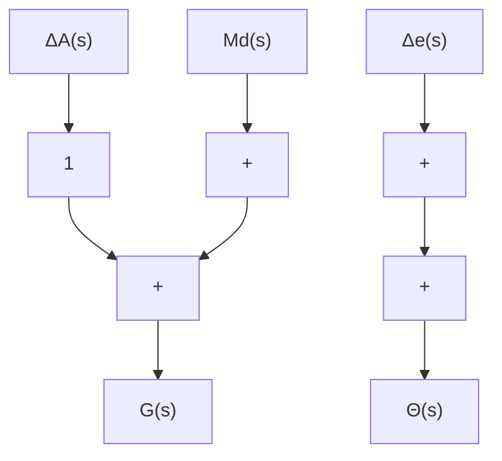
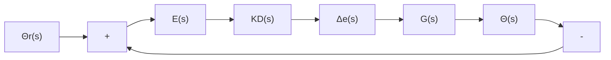

# 例 4-9 小型飞机的控制

图 4-31 所示为 Piper Dakota 小型飞机, 升降舵和俯仰角姿态之间的传递函数为

$$
\begin{array}{l} G (s) = \frac {\Theta (s)}{\Delta_ {e} (s)} = \frac {1 6 0 (s + 2 . 5) (s + 0 . 7)}{(s ^ {2} + 5 s + 4 0) (s ^ {2} + 0 . 0 3 s + 0 . 0 6)} \\ = \frac {1 6 0 (s + 2 . 5) (s + 0 . 7)}{(s + 2 . 5 + \mathrm{j} 5 . 8 1) (s + 2 . 5 - \mathrm{j} 5 . 8 1) (s + 0 . 0 1 5 + \mathrm{j} 0 . 2 4) (s + 0 . 0 1 5 - \mathrm{j} 0 . 2 4)} \\ \end{array}
$$

式中， $\theta$ 为俯仰角，单位为度( $^{\circ}$ )； $\delta_{e}$ 为升降舵偏角，单位为度( $^{\circ}$ )。

natural_image

Silhouette of a small airplane in flight against a dark background (no visible text or symbols)

(a)

text_image

微调舵 δt
升降舵 δe

(b)   
图 4-31 Piper Dakota 飞机以及调整舵与升降舵示意图

要求：

(1) 设计自动驾驶仪, 要求对于升降舵阶跃输入时, 调节时间不超过 $4\mathrm{s}(\Delta = 2\%)$ , 超调量小于 $10\%$ 。  
(2) 当有一个常量扰动力矩作用于飞机上, 也就是重心偏移的情况, 为了使飞机平稳飞行, 驾驶仪必须提供一个固定的控制力给控制器, 以使飞机能够平稳飞行。扰动力矩和姿态之间的传递函数与由升降舵得到的传递函数相同, 即

$$\frac {\Theta (s)}{M _ {d} (s)} = \frac {1 6 0 (s + 2 . 5) (s + 0 . 7)}{(s ^ {2} + 5 s + 4 0) (s ^ {2} + 0 . 0 3 s + 0 . 0 6)}$$

其中 $M_{d}$ 为作用在飞机上的力矩，在飞机尾翼上有一个单独的微调舵 $\delta_{t}$ ，它自身可以动作用来改变施加于飞机上的力矩，如图4-31所示。其影响可以用图4-32(a)中的框图来表示，在人工驾驶与自动驾驶下都希望可以通过调节微调器来使升降舵的输出为零，即 $\delta_{e} = 0$ 。在手动驾驶时，这意味着使飞机可以保持一定姿态而不需要施加外力。在自动驾驶时，可以减少电能的需要量以及可以减少因需操纵升降舵而造成的伺服电机的磨损。试设计自动驾驶仪来控制微调舵 $\delta_{t}$ ，使 $\delta_{e}$ 的稳定值在任意固定力矩 $M_{d}$ 下为零并且能满足要求(1)部分中的性能指标。

解（1）为了保证超调量小于 $10\%$ ，图3-12表明， $\zeta$ 应当大于0.6；为了满足调节时间 $t_{s}\leqslant 4s$ $(\Delta = 2\%)$ 的要求，式(3-23)指出，对于理想的二阶系统，当取 $\zeta \geqslant 0.6$ 时， $\omega_{n}$ 必须大于1.83rad/s。

刚开始设计时,研究比例反馈的系统特征通常都是有意义的,就是使 $D(s)=1$ ,如图 4-32(b) 中

flowchart

(a) 开环系统

flowchart

