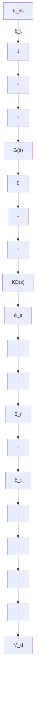
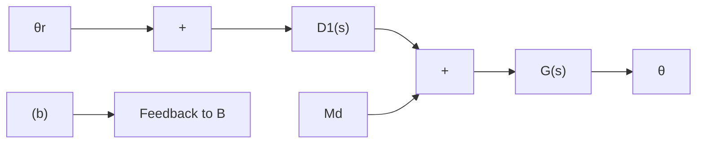

总之，主要的设计步骤包括调整补偿以影响快速根，并考察上述调节对时间响应的影响，反复进行以上设计直到性能指标得到满足为止。

(2) 调整舵的作用是通过提供一个力矩来消除升降舵在稳态时的非零输入, 此时若对升降舵输出 $\delta_{e}$ 积分, 并将积分反馈到输入调整装置, 那么调整舵就能提供飞机保持在任意姿态的力矩, 消除稳态时的 $\delta_{e}$ 输入, 这种思想可以由图 4-35(a) 来说明。

若积分器的增益足够小,那么由于引入的积分环节对系统稳定性的影响非常小,同时由于反馈环没有改变,系统响应也与原来相似。为便于分析,图 4-35(a)所示的框图可经简化为图 4-35(b),其补偿环节包括 PI 控制形式:

$$D _ {I} (s) = K D (s) \left(1 + \frac {K _ {I}}{s}\right)$$

在分析过程中始终都要明白,实际的补偿部分有两个输出,即 $\delta_{e}$ (用于升降舵伺服电机) 和 $\delta_{t}$ (用于调整舵伺服电机)。

flowchart

flowchart

图 4-35 调整舵控制回路的框图

加入积分项的系统特征方程为

$$1 + K D G + \frac {K _ {I}}{s} K D G = 0$$

为便于研究,很有必要绘出系统随 $K_{1}$ 变化的根轨迹,但是上式并不符合特征方程的标准形式,于是,将上式除以 $(1+KDG)$ 得

$$1 + \frac {(K _ {I} / s) K D G}{1 + K D G} = 0$$

为使上式变为根轨迹形式，令

$$L (s) = \frac {1}{s} \frac {K D G}{1 + K D G}$$

在 MATLAB 中, 可以用 sys1 来计算 $\frac{KDG}{1+KDG}$ , 用 sys2 = tf(1, [10]) 来构造积分器, 而由 $K_{I}$ 所决定的回路增益可以用 sys = sys1 \* sys2 来求取, 关于 $K_{I}$ 的根轨迹则用命令 rlocus(sys) 绘出。

line

| Real Axis | Imaginary Axis |
| --- | --- |
| -8 | 13 |
| -8 | 0 |
| -8 | -13 |
| -8 | -18 |
| -2 | 0 |
| -2 | 0 |
| -2 | 0 |
| -2 | 0 |
| 0 | 0 |
| 0 | 0 |
| 0 | 0 |
| 0 | 0 |
| 0 | 0 |
| 0 | 0 |
| 0 | 0 |
| 0 | 0 |
| 0 | 0 |
| 0 | 0 |
| 0 | 0 |
| 0         |
| 0 | 0 |
| --- | --- |
| 0 | 0 |
| 0 | 0 |
| 0 | 0 |
| 0 | 0 |
| 0 | 0 |
| 0 | 0 |
| 0 | 0 |
| 0 | 0 |
| 0 | 0 |
| 0 | 0 |

  
图4-36 积分控制与超前补偿系统，当 $K = 1.5$ 时以 $K_{I}$ 为参数的根轨迹  
(对应 $K_{I}=0.15$ 的根在图中以·标出)
