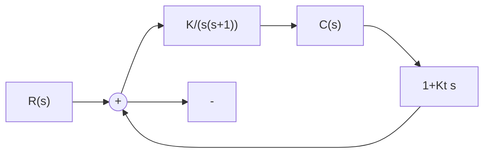
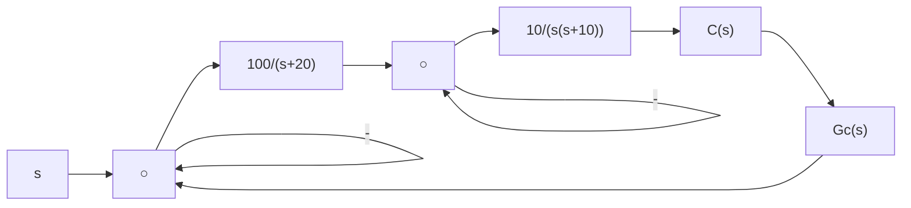
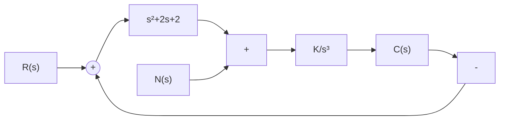

$$G (s) = \frac {K ^ {*}}{s ^ {2} (s + 2) (s + 5)}, \quad H (s) = 1$$

要求：

(1) 概略绘出系统根轨迹图, 并判断闭环系统的稳定性;

(2) 如果改变反馈通路传递函数, 使 $H(s) = 1 + 2s$ , 试判断 $H(s)$ 改变后的系统稳定性, 研究由于 $H(s)$ 改变所产生的效应。

4-11 试绘出下列多项式方程的根轨迹：

(1) $s^{3}+2s^{2}+3s+Ks+2K=0;$   
(2) $s^3 + 3s^2 + (K + 2)s + 10K = 0$ 。

4-12 设系统开环传递函数如下,试画出 b 从零变到无穷时的根轨迹图:

(1) $G(s) = \frac{20}{(s + 4)(s + b)};$   
(2) $G(s) = \frac{30(s + b)}{s(s + 10)}$

4-13 设控制系统的结构图如图 4-39 所示,试概略绘制其根轨迹图。

flowchart

图 4-39 控制系统

4-14 设单位反馈控制系统的开环传递函数为

$$G (s) = \frac {K ^ {*} (1 - s)}{s (s + 2)}$$

试绘制其根轨迹图，并求出使系统产生重实根和纯虚根的 $K^{*}$ 值。

4-15 设控制系统如图 4-40 所示, 试概略绘出 $K_{t} = 0, 0 < K_{t} < 1, K_{t} > 1$ 时的根轨迹。若取 $K_{t} = 0.5$ , 试求出 $K = 10$ 时的闭环零、极点, 并估算系统的动态性能。

flowchart

图 4-40 控制系统

4-16 设控制系统开环传递函数为

$$G (s) = \frac {K ^ {*} (s + 1)}{s ^ {2} (s + 2) (s + 4)}$$

试分别画出正反馈系统和负反馈系统的根轨迹图，并指出它们的稳定情况有何不同？

4-17 设控制系统如图 4-41 所示, 其中 $G_{c}(s)$ 为改善系统性能而加入的校正装置。若 $G_{c}(s)$ 可从 $K_{t}s, K_{a}s^{2}$ 和 $K_{a}s^{2}/(s+20)$ 三种传递函数中任选一种, 你选择哪一种? 为什么?

flowchart

图 4-41 控制系统

4-18 设系统如图 4-42 所示。试作闭环系统根轨迹，并分析 K 值变化对系统在阶跃扰动作用下响应 $c_{n}(t)$ 的影响。

flowchart

图4-42 控制系统
