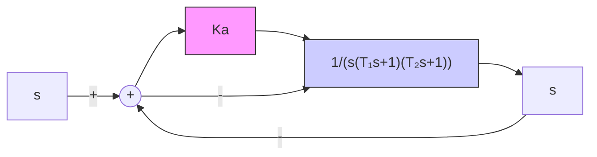

4-19 图 4-43 为激光操作控制系统, 可用于外科手术时在人体内钻孔。手术要求激光操作系统必须有高度精确的位置和速度响应, 因此直流电机的参数选为: 激磁时间常数 $T_{1} = 0.1 \mathrm{~s}$ , 电机和载荷组合的机电时间常数 $T_{2} = 0.2 \mathrm{~s}$ 。要求调整放大器增益 $K_{a}$ , 使系统在斜坡输入 $r(t) = A t (A = 1 \mathrm{~mm} / \mathrm{s})$ 时, 系统稳态误差 $e_{s} (\infty) \leqslant 0.1 \mathrm{~mm}$ 。

flowchart

图 4-43 激光操作控制系统

4-20 图 4-44 为空间站示意图。为了有利于产生能量和进行通信，必须保持空间站对太阳和地球的合适指向。空间站的方位控制系统可由带有执行机构和控制器的单位反馈控制系统来表征，其开环传递函数为

$$G (s) = \frac {K ^ {*} (s + 2 0)}{s (s ^ {2} + 2 4 s + 1 4 4)}$$

试画出 $K^{*}$ 值增大时的系统概略根轨迹图，并求出使系统产生振荡的 $K^{*}$ 的取值范围。

text_image

雷达天线
太阳能电池板
火箭
调姿火箭
航天飞机

图4-44 空间站

4-21 一种由耐热性好、重量轻的材料制成的未来超音速客机如图 4-45(a) 所示。该机可容纳 300 名乘客，并配备先进的计算机控制系统，以三倍音速在高空飞行。为该型飞机设计的一种自动飞行控制系统如图4-45(b)所示。系统主导极点的理想阻尼比 $\zeta_0 = 0.707$ ；飞机的特征参数为 $\omega_{n} = 2.5, \zeta = 0.3, \tau = 0.1$ ；增益因子 $K_{1}$ 的可调范围较大：当飞机飞行状态从中等重量巡航变为轻重量降落时， $K_{1}$ 可以从0.02变到0.2。要求：

(1) 画出增益 $K_{1}K_{2}$ 变化时, 系统的概略根轨迹图;  
(2) 当飞机以中等重量巡航时, 确定 $K_{2}$ 的取值, 使系统阻尼比 $\zeta_{0}=0.707$ ;  
(3) 若 $K_{2}$ 由(2)中给出, $K_{1}$ 为轻重量降落时的增益, 试确定系统的阻尼比 $\zeta_{0}$ 。

natural_image

Side profile illustration of a futuristic aircraft with long nose cone and visible internal components (no text or symbols)

(a) 未来的超音速喷气式客机

flowchart

(b) 控制系统  
图 4-45 飞机纵向控制系统结构图

4-22 在带钢热轧过程中,用于保持恒定张力的控制系统称为“环轮”,其典型结构图如图 4-46 所示。环轮有一个 0.6\~0.9m 长的臂,其末端有一卷轴,通过电机可将环轮升起,以便挤压带钢。带钢通过环轮的典型速度为 10.16m/s。假设环轮位移变化与带钢张力的变化成正比,且滤波器时间常数 T 可略去不计。要求:
