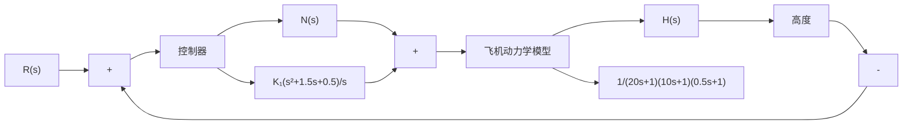
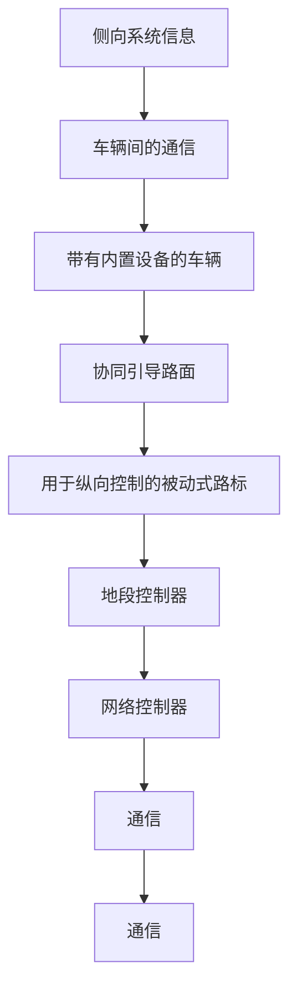
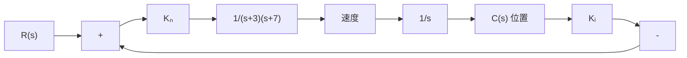

(1) 概略绘出 $0 < K_{a} < \infty$ 时系统的根轨迹图；  
(2) 确定增益 $K_{a}$ 的取值, 使系统闭环极点的阻尼比 $\zeta \geqslant 0.707$ 。

4-23 图 4-47(a) 是 V-22 鱼鹰型倾斜旋翼飞机示意图。V-22 既是一种普通飞机，又是一种直升机。当飞机起飞和着陆时，其发动机位置可以如图示那样，使 V-22 像直升机那样垂直起降；而在起飞后，它又可以将发动机旋转 $90^{\circ}$ ，切换到水平位置，像普通飞机一样飞行。在直升机模式下，飞机的高度控制系统如图 4-47(b) 所示。要求：

(1) 概略绘出当控制器增益 $K_{1}$ 变化时的系统根轨迹图, 确定使系统稳定的 $K_{1}$ 值范围;  
(2) 当取 $K_{1}=280$ 时, 求系统对单位阶跃输入 $r(t)=1(t)$ 的实际输出 $h(t)$ , 并确定系统的超调量和调节时间 ( $\Delta=2\%$ );  
(3) 当 $K_{1}=280, r(t)=0$ 时，求系统对单位阶跃扰动 $N(s)=1/s$ 的输出 $h_{n}(t)$ ;

  
图 4-46 轧钢机控制系统

natural_image

Illustration of a propeller aircraft in flight, showing fuselage, wings, and propeller (no text or symbols)

(a) V-22鱼鹰型倾斜旋翼(飞机)

flowchart

(b) 控制系统  
图 4-47 V-22 鱼鹰型倾斜旋翼机的高度控制系统

(4) 若在 $R(s)$ 和第一个比较点之间增加一个前置滤波器

$$G _ {p} (s) = \frac {0 . 5}{s ^ {2} + 1 . 5 s + 0 . 5}$$

试重解问题(2)。

4-24 在未来的智能汽车-高速公路系统中，汇集了各种电子设备，可以提供事故、堵塞、路径规划、路边服务和交通控制等实时信息。图 4-48(a) 所示为自动化高速公路系统，图 4-48(b) 给出的是保持车辆间距的位置控制系统。要求选择放大器增益 $K_a$ 和速度反馈系数 $K_t$ 的取值，使系统响应单位斜坡输入 $R(s) = 1/s^2$ 的稳态误差小于 0.5，单位阶跃响应的超调量小于 10%，调节时间小于 $2s(\Delta = 5\%)$ 。

flowchart

(a) 自动化高速公路系统

flowchart

(b) 车辆间距控制系统  
图 4-48 智能汽车-高速公路系统
