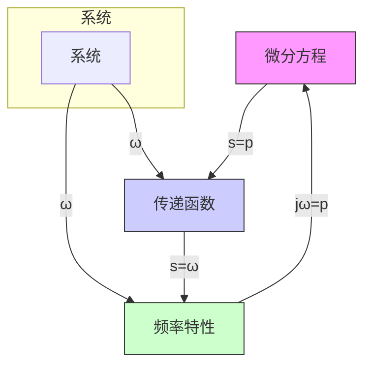

式(5-16)表明,对于稳定的线性定常系统,由谐波输入产生的输出稳态分量仍然是与输入同频率的谐波函数,而幅值和相位的变化是频率 $\omega$ 的函数,且与系统数学模型相关。为此,定义谐波输入下,输出响应中与输入同频率的谐波分量与谐波输入的幅值之比 $A(\omega)$ 为幅频特性,相位之差 $\varphi(\omega)$ 为相频特性,并称其指数表达形式

$$G (\mathrm{j} \omega) = A (\omega) \mathrm{e} ^ {\mathrm{j} \varphi (\omega)} \tag {5-18}$$

为系统的频率特性。

上述频率特性的定义既可以适用于稳定系统，也可适用于不稳定系统。稳定系统的频率特性可以用实验方法确定，即在系统的输入端施加不同频率的正弦信号，然后测量系统输出的稳态响应，再根据幅值比和相位差作出系统的频率特性曲线。频率特性也是系统数学模型的一种表达形式。RC滤波网络的频率特性曲线如图5-3所示。

line

| ωT | 1/√(1+ω²T²) |
| --- | --- |
| 0.0 | 1.0 |
| 0.5 | 0.9 |
| 1.0 | 0.7 |
| 1.5 | 0.55 |
| 2.0 | 0.45 |
| 2.5 | 0.35 |
| 3.0 | 0.3 |
| 3.5 | 0.25 |
| 4.0 | 0.22 |
| 4.5 | 0.2 |
| 5.0 | 0.18 |

(a) 幅频特性

line

| ωT | -arctan ωT |
| --- | --- |
| 0.0 | 0.0 |
| 0.5 | -20.0 |
| 1.0 | -40.0 |
| 1.5 | -55.0 |
| 2.0 | -65.0 |
| 2.5 | -70.0 |
| 3.0 | -75.0 |
| 3.5 | -78.0 |
| 4.0 | -80.0 |
| 4.5 | -82.0 |
| 5.0 | -83.0 |

(b) 相频特性  
图 5-3 RC 网络的幅频特性和相频特性曲线 (MATLAB)

对于不稳定系统,输出响应稳态分量中含有由系统传递函数的不稳定极点产生的呈发散或振荡发散的分量,所以不稳定系统的频率特性不能通过实验方法确定。

线性定常系统的传递函数为零初始条件下，输出和输入的拉氏变换之比

$$G (s) = \frac {C (s)}{R (s)}$$

上式的反变换式为

$$g (t) = \frac {1}{2 \pi \mathrm{j}} \int_ {\sigma - \mathrm{j} \infty} ^ {\sigma + \mathrm{j} \infty} G (s) \mathrm{e} ^ {s t} \mathrm{d} s$$

flowchart

图 5-4 频率特性、传递函数和微分方程三种系统描述之间的关系

式中， $\sigma$ 位于 $G(s)$ 的收敛域。若系统稳定，则 $\sigma$ 可以取为零。如果 $r(t)$ 的傅氏变换存在，可令 $s = \mathrm{j}\omega$

$$g (t) = \frac {1}{2 \pi} \int_ {- \infty} ^ {\infty} G (\mathrm{j} \omega) \mathrm{e} ^ {\mathrm{j} \omega t} \mathrm{d} \omega = \frac {1}{2 \pi} \int_ {- \infty} ^ {\infty} \frac {C (\mathrm{j} \omega)}{R (\mathrm{j} \omega)} \mathrm{e} ^ {\mathrm{j} \omega t} \mathrm{d} \omega$$

因而

$$G (\mathrm{j} \omega) = \frac {C (\mathrm{j} \omega)}{R (\mathrm{j} \omega)} = G (s) \mid_ {s = \mathrm{j} \omega} \tag {5-19}$$

由此可知，稳定系统的频率特性等于输出和输入的傅氏变换之比，而这正是频率特性的物理意义。频率特性与微分方程和传递函数一样，也表征了系统的运动

规律,成为系统频域分析的理论依据。系统三种描述方法的关系可用图 5-4 说明。
