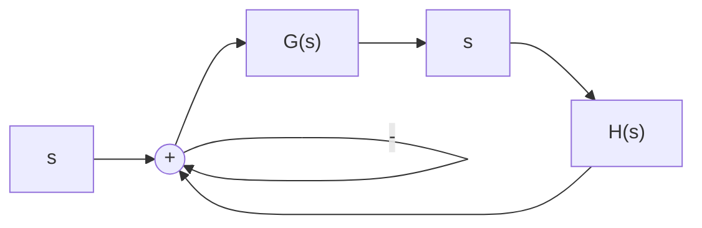

# 5-2 典型环节与开环系统的频率特性

设线性定常系统结构如图 5-9 所示, 其开环传递函数为 $G(s)H(s)$ , 为了绘制系统开环频率特性曲线,本节先研究开环系统的典型环节及相应的频率特性。

flowchart

```mermaid
graph LR
    R["s"] --> O((+))
    O --> G["G(s)"]
    G --> C["s"]
    C["s"] --> H["H(s)"]
    H --> O
    O -->|-| O
```

图 5-9 典型系统结构图
