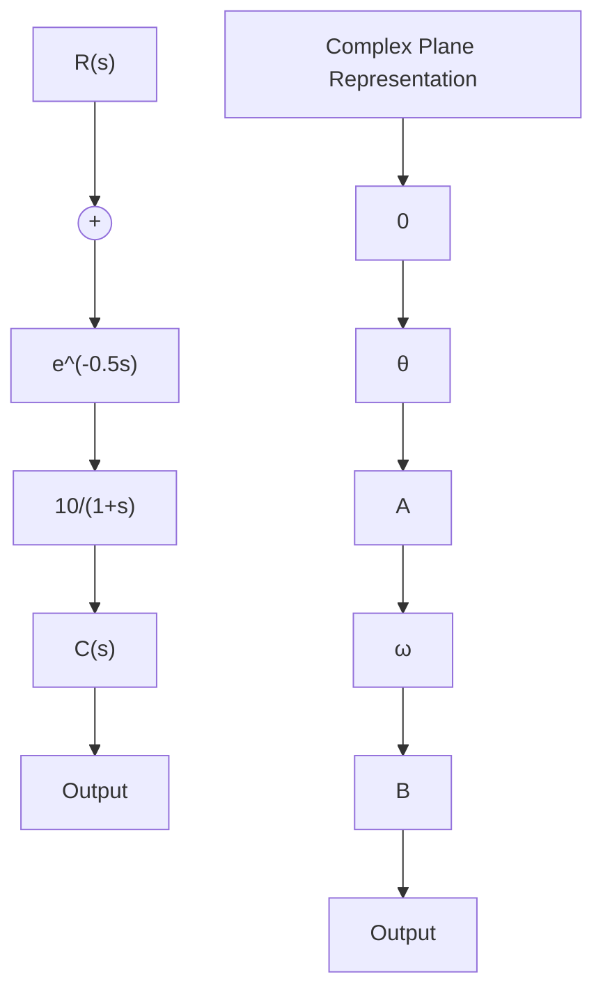

# 5. 延迟环节和延迟系统

输出量经恒定延时后不失真地复现输入量变化的环节称为延迟环节。含有延迟环节的系统称为延迟系统。化工、电力系统多为延迟系统。延迟环节的输入输出的时域表达式为

$$c (t) = 1 (t - \tau) r (t - \tau) \tag {5-58}$$

式中， $\tau$ 为延迟时间，应用拉氏变换的实数位移定理，可得延迟环节的传递函数

$$G (s) = \frac {C (s)}{R (s)} = \mathrm{e} ^ {- s} \tag {5-59}$$

延迟环节的频率特性为

$$G (\mathrm{j} \omega) = \mathrm{e} ^ {- \mathrm{j} \omega} = 1 \cdot \underline {{\left/ - 5 7 . 3 \tau \omega \left. \right.}} \tag {5-60}$$

由式(5-60)可知,延迟环节幅相曲线为单位圆。当系统存在延迟现象,即开环系统表现为延迟环节和线性环节的串联形式时,延迟环节对系统开环频率特性的影响是造成了相频特性的明显变化。如图5-26所示,当线性环节 $G(s)=\frac{10}{1+s}$ 与延迟环节 $e^{-0.5s}$ 串联后,系统开环幅相曲线为螺旋线。图中以(5,j0)为圆心,半径为5的半圆为惯性环节的幅相曲线,任取频率点 $\omega$ ,设惯性环节的频率特性点为

flowchart

图 5-26 延迟系统及其开环幅相曲线

A, 则延迟系统的幅相曲线的 B 点位于以 $\left|OA\right|$ 为半径，距 A 点圆心角 $\theta=57.3\times0.5\omega$ 的圆弧处。
