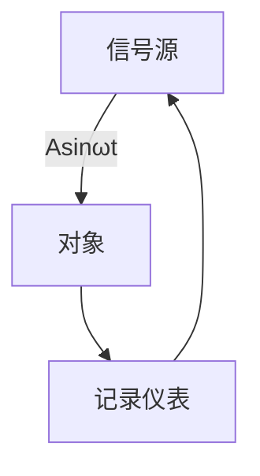

# (1) 频率响应实验

频率响应实验原理如图 5-27 所示。首先选择信号源输出的正弦信号的幅值，以使系统处于非饱和状态。在一定频率范围内，改变输入正弦信号的频率，记录各频率点处系统输出信号的波形。由稳态段的输入输出信号的幅值比和相位差绘制对数频率特性曲线。

flowchart

```mermaid
graph TD
    A["信号源"] -->|Asinωt| B["对象"]
    B --> C["记录仪表"]
    C --> A
```

图 5-27 频率响应实验原理
