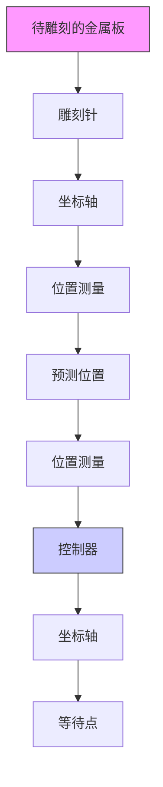
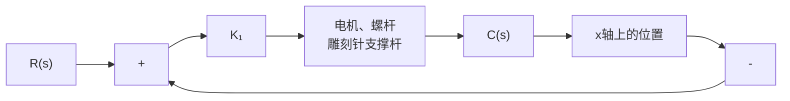

# 例 5-18 雕刻机控制系统

图 5-52(a) 所示为雕刻机, 其 x 轴方向配有两台驱动电机, 用来驱动雕刻针运动; 另外, 还各有一台单独的电机用于在 y 轴和 z 轴方向驱动雕刻针。雕刻机 x 轴方向位置控制系统模型如图 5-52(b) 所示。

flowchart

(a) 雕刻机

flowchart

(b) 结构图模型  
图 5-52 雕刻机控制系统

本例的设计目标是：用频率响应法选择控制器增益 $K_{1}$ 的值，使系统阶跃响应的各项指标保持在允许范围内。

解 本例设计的基本思路是：首先选择增益 $K_{1}$ 的初始值，绘制系统的开环和闭环对数频率特性曲线，然后用闭环对数频率特性来估算系统时间响应的各项指标。若系统性能不满足设计要求，则调整 $K_{1}$ 的取值，重复以上设计过程。最后，用实际系统的仿真来检验设计结果。

现在,取 $K_{1}=2$ , 则系统开环频率特性为

$$G (\mathrm{j} \omega) = \frac {1}{\mathrm{j} \omega (0 . 5 \mathrm{j} \omega + 1) (\mathrm{j} \omega + 1)}$$

计算 $G(j\omega)$ 的幅值与相位，如表 5-3 所示。根据表 5-3 可绘制开环对数频率特性图如图 5-53 所示。由图可见，系统的相角裕度 $\gamma=33^{\circ}$ ，相应的闭环系统是稳定的。

表 5-3 雕刻机 $G(\mathrm{j}\omega)$ 的频率响应

<table><tr><td>a</td><td>0.2</td><td>0.4</td><td>0.8</td><td>1.0</td><td>1.4</td><td>1.8</td></tr><tr><td>2016-05</td><td>14</td><td>7</td><td>-1</td><td>-4</td><td>-9</td><td>-13</td></tr><tr><td>2016-05</td><td>-107</td><td>-123</td><td>-150.5</td><td>-162</td><td>-179.5</td><td>-193</td></tr></table>

  
图 5-53 雕刻机 $G(j\omega)$ 的开环对数频率特性图

由闭环频率特性函数

$$
\begin{array}{l} \Phi (\mathrm{j} \omega) = \frac {2}{(\mathrm{j} \omega) ^ {3} + 3 (\mathrm{j} \omega) ^ {2} + 2 (\mathrm{j} \omega) + 2} \\ = \frac {2}{(2 - 3 \omega^ {2}) + \mathrm{j} \omega (2 - \omega) ^ {2}} \\ \end{array}
$$

  
图 5-54 闭环对数频率特性图(MATLAB)

可以画出闭环频率特性曲线,如图 5-54 所示。

由图可见,系统存在谐振频率,其值 $\omega_{r}=0.8$ , 相应的谐振峰值

$$2 0 \lg M _ {r} = 5 \mathrm{dB}, \quad M _ {r} = 1. 7 8$$
