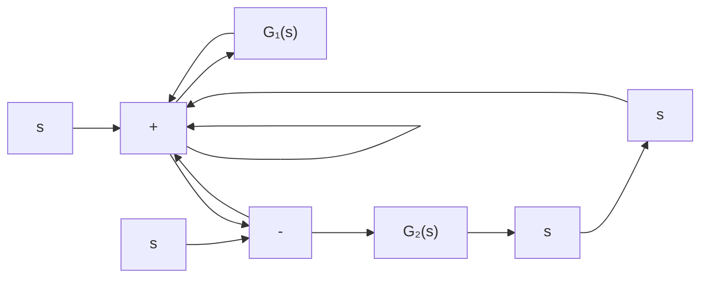

natural_image

Illustration of a space shuttle with a crew member on top, showing structural components and no text or symbols.

(a)

flowchart

(b)   
图 5-67 航天飞机机械臂控制系统

5-27 试验中的旋翼飞机装有一个可以旋转的机翼，如图5-68所示。当飞机速度较低时，机翼将处在正常位置；而在飞机速度较高时，机翼将旋转到一个其他的合适位置，以便改善飞机的超音速飞行品质。假定飞机控制系统的 $H(s) = 1$ ，且

$$G (s) = \frac {4 (0 . 5 s + 1)}{s (2 s + 1) \left[ \left(\frac {s}{8}\right) ^ {2} + \left(\frac {s}{2 0}\right) + 1 \right]}$$

要求：

(1) 绘制开环系统的对数频率特性曲线；  
(2) 确定幅值增益为 0dB 时对应的频率 $\omega_{c}$ 和相角为 $-180^{\circ}$ 时对应的频率 $\omega_{x}$ 。

5-28 美国卡耐尔基-梅隆大学机器人研究所开发研制了一套用于星际探索的系统，其目标机器人是一个六足步行机器人，如图 5-69(a) 所示。该机器人单足控制系统结构图如图 5-69(b) 所示。

text_image

机翼最大
扭转位置

natural_image

Side profile illustration of a military aircraft with visible fuselage, tail, and windows (no text or symbols)

图 5-68 旋转翼飞机

要求：

(1) 绘制 K=20 时, 闭环系统的对数频率特性;  
(2) 分别确定 K=20 和 K=40 时，闭环系统的谐振峰值 $M_{r}$ 、谐振频率 $\omega_{r}$ 和带宽频率 $\omega_{b}$ 。

5-29 在脑外科、眼外科等类似手术中，患者肌肉的无意识运动可能会导致灾难性的后果。

为了保证合适的手术条件,可以采用控制系统实施自动麻醉,以保证稳定的用药量,使患者肌肉放松。图 5-70 为麻醉控制系统模型,试确定控制器增益 K 和时间常数 $\tau$ ,使系统谐振峰值 $M_{r} \leqslant 1.5$ ,并确定相应的闭环带宽频率 $\omega_{b}$ 。

natural_image

Illustration of a traditional cylindrical water heater with support structures (no text or symbols)

(a)

flowchart

