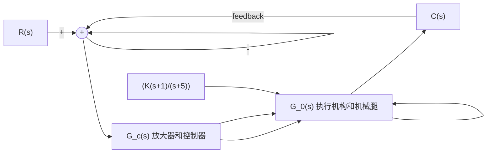
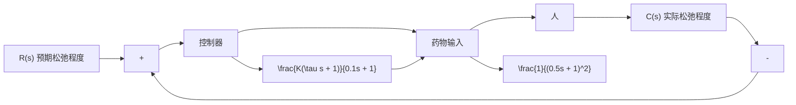

```mermaid
graph LR
    R["R(s)"] --> |+| Sum((+))
    Sum --> Gc["G_c(s) 放大器和控制器"]
    Gc --> G0["G_0(s) 执行机构和机械腿"]
    G0 --> C["C(s)"]
    C --> |feedback| Sum
    Sum -->|-| Sum
    Gc --> G0
    K["(K(s+1)/(s+5))"] --> G0
    G0 --> G0
```

(b)

图 5-69 步行机器人  

flowchart

```mermaid
graph LR
    A["R(s) 预期松弛程度"] --> B["+"]
    B --> C["控制器"]
    C --> D["药物输入"]
    D --> E["人"]
    E --> F["C(s) 实际松弛程度"]
    F --> G["-"]
    G --> B
    C --> H["\frac{K(\tau s + 1)}{0.1s + 1}"]
    H --> D
    D --> I["\frac{1}{(0.5s + 1)^2}"]
```

图 5-70 麻醉控制系统
