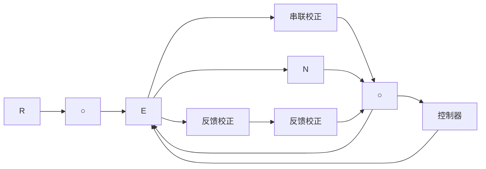
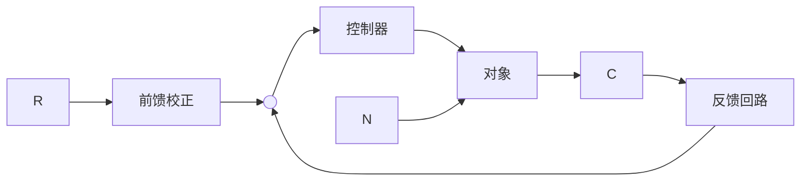
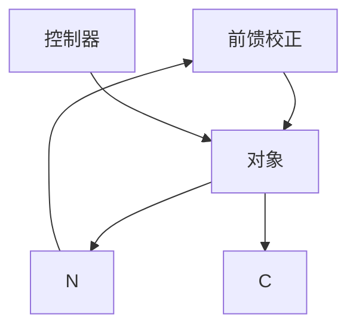
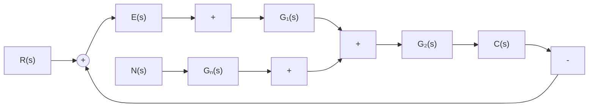
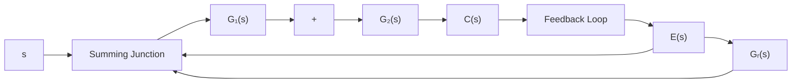

# 3. 校正方式

按照校正装置在系统中的连接方式,控制系统校正方式可分为串联校正、反馈校正、前馈校正和复合校正四种。

串联校正装置一般接在系统误差测量点之后和放大器之前，串接于系统前向通道之中；反馈校正装置接在系统局部反馈通路之中。串联校正与反馈校正连接方式如图6-2所示。

  
图 6-1 系统带宽的确定

前馈校正又称顺馈校正，是在系统主反馈回路之外采用的校正方式。前馈校正装置接在系统给定值(或指令、参考输入信号)之后及主反馈作用点之前的前向通道上,如图 6-3(a)所示,这种校正装置的作用相当于对给定值信号进行整形或滤波后,再送入反馈系统,因此又称为前置滤波器;另一种前馈校正装置接在系统可测扰动作用点与误差测量点之间,对扰动信号进行直接或间接测量,并经变换后接入系

flowchart

图 6-2 串联校正与反馈校正

统，形成一条附加的对扰动影响进行补偿的通道，如图6-3(b)所示。前馈校正可以单独作用于开环控制系统，也可以作为反馈控制系统的附加校正而组成复合控制系统。

flowchart

(a)

flowchart

(b)   
图 6-3 前馈校正

复合校正方式是在反馈控制回路中，加入前馈校正通路，组成一个有机整体，如图6-4所示。图中(a)为按扰动补偿的复合控制形式，(b)为按输入补偿的复合控制形式。

flowchart

(a)

flowchart

(b)   
图 6-4 复合校正

在控制系统设计中,常用的校正方式为串联校正、反馈校正和前馈校正。究竟选用哪种校正方式,取决于系统中的信号性质、技术实现的方便性、可供选用的元件、抗扰性要求、经济性要求、环境使用条件以及设计者的经验等因素。
