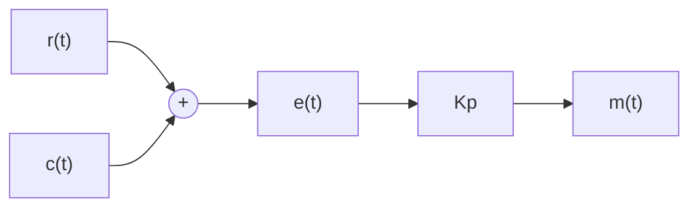

# 4. 基本控制规律

确定校正装置的具体形式时，应先了解校正装置所需提供的控制规律，以便选择相应的元件。包含校正装置在内的控制器，常常采用比例、微分、积分等基本控制规律，或者采用这些基本控制规律的某些组合，如比例-微分、比例-积分、比例-积分-微分等组合控制规律，以实现对被控对象的有效控制。

flowchart

```mermaid
graph LR
    A["r(t)"] --> B((+))
    C["c(t)"] --> B
    B --> D["e(t)"]
    D --> E["Kp"]
    E --> F["m(t)"]
```

图 6-5 P 控制器
