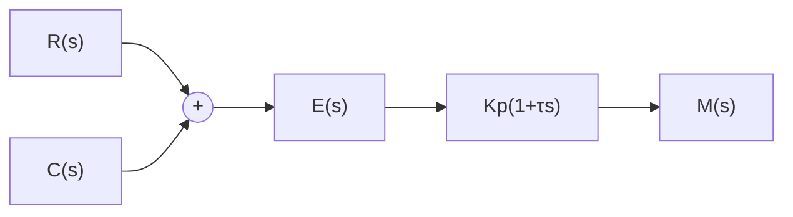

# (2) 比例-微分(PD)控制规律

具有比例-微分控制规律的控制器,称为 PD 控制器,其输出 $m(t)$ 与输入 $e(t)$ 的关系为

$$m (t) = K _ {p} e (t) + K _ {p} \tau \frac {\mathrm{d} e (t)}{\mathrm{d} t} \tag {6-12}$$

式中， $K_{p}$ 为比例系数； $\tau$ 为微分时间常数。 $K_{p}$ 与 $\tau$ 都是可调的参数。PD 控制器如图 6-6 所示。

PD 控制器中的微分控制规律,能反应输入信号的变化趋势,产生有效的早期修正信号,以增加系统的阻尼程度,从而改善系统的稳定性。在串联校正时,可使系统增加一个 $-1/\tau$ 的开环零点,使系统的相角裕度提高,因而有助于系统动态性能的改善。

例 6-1 设比例-微分控制系统如图 6-7 所示,试分析 PD 控制器对系统性能的影响。

flowchart

图 6-6 PD 控制器

flowchart

图 6-7 比例-微分控制系统

解 无 PD 控制器时,系统的闭环特征方程为

$$J s ^ {2} + 1 = 0$$

显然，系统的阻尼比等于零，其输出 $c(t)$ 具有不衰减的等幅振荡形式，系统处于临界稳定状态，即实际上的不稳定状态。

接入 PD 控制器后,闭环系统特征方程为

$$J s ^ {2} + K _ {p} \tau s + K _ {p} = 0$$

其阻尼比 $\zeta=\tau\sqrt{K_{p}}/2\sqrt{J}>0$ ，因此闭环系统是稳定的。PD 控制器提高系统的阻尼程度，可通过参数 $K_{p}$ 及 $\tau$ 来调整。

需要指出,因为微分控制作用只对动态过程起作用,而对稳态过程没有影响,且对系统噪声非常敏感,所以单一的 D 控制器在任何情况下都不宜与被控对象串联起来单独使用。通常,微分控制规律总是与比例控制规律或比例-积分控制规律结合起来,构成组合的 PD 或 PID 控制器,应用于实际的控制系统。
