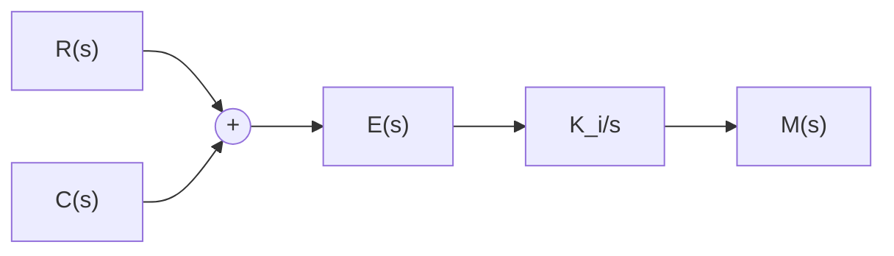
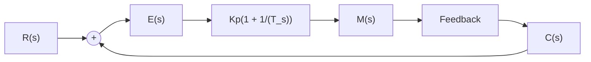
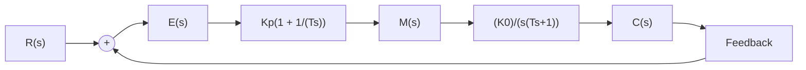

# (4) 比例-积分(PI)控制规律

具有比例-积分控制规律的控制器,称 PI 控制器,其输出信号 $m(t)$ 同时成比例地反应输入信号 $e(t)$ 及其积分,即

$$m (t) = K _ {p} e (t) + \frac {K _ {p}}{T _ {i}} \int_ {0} ^ {t} e (t) \mathrm{d} t \tag {6-14}$$

式中， $K_{p}$ 为可调比例系数； $T_{i}$ 为可调积分时间常数。PI 控制器如图 6-9 所示。

flowchart

图 6-8 I 控制器

flowchart

图 6-9 PI 控制器

在串联校正时，PI控制器相当于在系统中增加了一个位于原点的开环极点，同时也增加了一个位于 s 左半平面的开环零点。位于原点的极点可以提高系统的型别，以消除或减小系统的稳态误差，改善系统的稳态性能；而增加的负实零点则用来减小系统的阻尼程度，缓和 PI 控制器极点对系统稳定性及动态过程产生的不利影响。只要积分时间常数 $T_{i}$ 足够大，PI 控制器对系统稳定性的不利影响可大为减弱。在控制工程实践中，PI 控制器主要用来改善控制系统的稳态性能。

例 6-2 设比例-积分控制系统如图 6-10 所示。其中不可变部分的传递函数为

$$G _ {0} (s) = \frac {K _ {0}}{s (T s + 1)}$$

试分析 PI 控制器对系统稳态性能的改善作用。

flowchart

图 6-10 比例-积分控制系统

解 由图 6-10 可知, 系统不可变部分与 PI 控制器串联后, 其开环传递函数为

$$G (s) = \frac {K _ {0} K _ {p} (T _ {i} s + 1)}{T _ {i} s ^ {2} (T s + 1)}$$

可见，系统由原来的 I 型提高到含 PI 控制器时的 II 型。若系统的输入信号为斜坡函数 $r(t)=R_{1}t$ ，则由表 3-5 可知，在无 PI 控制器时，系统的稳态误差为 $R_{1}/K_{0}$ ；而接入 PI 控制器后，系统的稳态误差为零。表明 I 型系统采用 PI 控制器后，可以消除系统对斜坡输入信号的稳态误差，控制准确度大为改善。

采用 PI 控制器后,系统的特征方程为

$$T _ {i} T s ^ {3} + T _ {i} s ^ {2} + K _ {p} K _ {0} T _ {i} s + K _ {p} K _ {0} = 0$$

其中，参数 $\mathrm{T},\mathrm{T_i},\mathrm{K_0},\mathrm{K_p}$ 都是正数。由劳斯判据可知，调整 $PI$ 控制器的积分时间常数 $\mathbb{T}_{i}$ ，使之大于系统不可变部分的时间常数 $\mathbb{T}$ ，可以保证闭环系统的稳定性。
