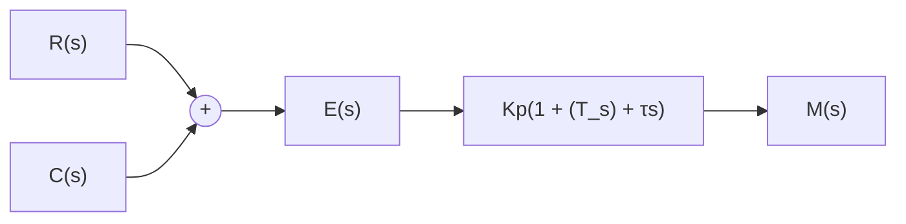

# (5) 比例-积分-微分(PID)控制规律

具有比例-积分-微分控制规律的控制器，称PID控制器。这种组合具有三种基本规律各自的特点，其运动方程为

$$m (t) = K _ {p} e (t) + \frac {K _ {p}}{T _ {i}} \int_ {0} ^ {t} e (t) \mathrm{d} t + K _ {p} \tau \frac {\mathrm{d} e (t)}{\mathrm{d} t} \tag {6-15}$$

相应的传递函数是

$$G _ {c} (s) = K _ {p} \left(1 + \frac {1}{T _ {i} s} + \tau s\right) = \frac {K _ {p}}{T _ {i}} \cdot \frac {T _ {i} \tau s ^ {2} + T _ {i} s + 1}{s} \tag {6-16}$$

PID 控制器如图 6-11 所示。

flowchart

图 6-11 PID 控制器

若 $4\tau / \mathrm{T}_i < 1$ ，式(6-16)还可写成

$$G _ {c} (s) = \frac {K _ {p}}{T _ {i}} \cdot \frac {(\tau_ {1} s + 1) (\tau_ {2} s + 1)}{s} \tag {6-17}$$

式中 $\tau_{1} = \frac{1}{2} T_{i}\left(1 + \sqrt{1 - \frac{4\tau}{T_{i}}}\right),\qquad \tau_{2} = \frac{1}{2} T_{i}\left(1 - \sqrt{1 - \frac{4\tau}{T_{i}}}\right)$

由式(6-17)可见, 当利用 PID 控制器进行串联校正时, 除可使系统的型别提高一级外, 还将提供两个负实零点。与 PI 控制器相比, PID 控制器除了同样具有提高系统的稳态性能的优点外, 还多提供一个负实零点, 从而在提高系统动态性能方面, 具有更大的优越性。因此, 在工业过程控制系统中, 广泛使用 PID 控制器。PID 控制器各部分参数的选择, 在系统现场调试中最后确定。通常, 应使 I 部分发生在系统频率特性的低频段, 以提高系统的稳态性能; 而使 D 部分发生在系统频率特性的中频段, 以改善系统的动态性能。
